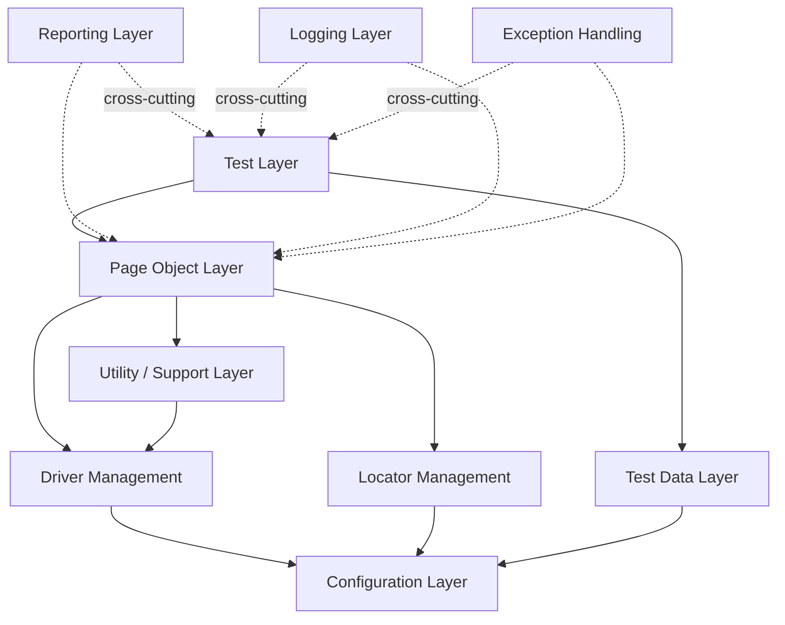
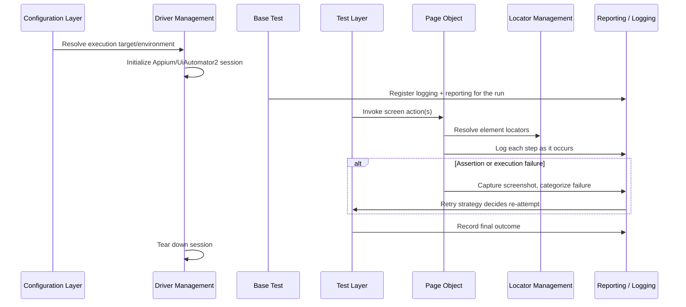

<div align="center">

# Enterprise Mobile Automation Framework

### Java · Appium · TestNG · Gradle

**A documentation-first Android test automation framework, built layer by layer and verified on a real device.**

[](#18-project-evolution)
[](#10-technology-stack)
[](#10-technology-stack)
[](#10-technology-stack)
[](#10-technology-stack)
[](#20-license)
[](#2-at-a-glance)

</div>

<br>

---

## 1. Hero

**Target application:** [Sauce Labs My Demo App (Android)](https://github.com/saucelabs/my-demo-app-android) — `com.saucelabs.mydemoapp.android`, exercised end-to-end on a real Android device through Appium's UiAutomator2 driver.

This is a layered Java automation framework governed by five versioned, cross-referenced engineering documents — requirements, test design, test cases, test data design, and a locator repository — all authored, audited, and frozen as part of the release. It currently automates 19 of 32 documented test cases.

---

## 2. At a Glance

<div align="center">

| | |
|:---|:---|
| **Framework Version** | 1.0.0 |
| **Current Release** | v1.0.0 |
| **Language** | Java 17 |
| **Platform** | Android — real device |
| **Architecture** | Layered · Page Object Model |
| **Automation Coverage** | 19 / 32 test cases (59%) |
| **Documentation** | 5 enterprise documents · frozen baseline |
| **Framework Status** | Release, actively maintained |
| **Execution Model** | Single-device, sequential |

</div>

---

## 3. Executive Summary

This repository is an Android UI test automation framework built against the Sauce Labs My Demo App, engineered around a simple premise: a framework's requirements, test design, and test cases should exist as reviewed, versioned documents before a single line of automation is written — not reconstructed afterward to justify the code.

It is built for QA engineers, SDETs, and engineering reviewers who want to see how a mobile automation framework is structured when traceability and evidence are treated as deliverables, not paperwork. Every automated test case in this repository can be traced from a functional requirement, through a test scenario and test case, to the exact test method and Page Object that implements it.

Framework Version 1.0.0 represents the current, real state of that effort: a layered architecture, nine Page Objects, ten locator classes, four test classes, and a frozen documentation baseline — automating 19 of the 32 test cases this project has defined and documented so far.

---

## 4. Why This Framework Exists

- **Documentation before implementation.** Requirements (MA-RS-001), test scenarios (MA-TD-001), and test cases (MA-TC-001) were authored and reviewed before the corresponding Page Object or test method was written.
- **Architecture freeze before automation.** The layered architecture (MA-FA-001) — configuration, driver, locator, utility, page object, and test layers — was defined and stabilized before any Page Object existed.
- **Evidence-based implementation.** Every locator in the repository was derived from direct analysis of the AUT's own resource IDs and `uiautomator` runtime evidence, not assumption.
- **Enterprise traceability.** Every automated test case links to a Functional Requirement and a Test Scenario — not just a class name.
- **A baseline that was actually verified, not just written.** The full documentation set went through a whole-project consistency audit and an independent re-verification pass before this release was called done.

---

## 5. What Makes This Framework Different

Not a feature list — a description of engineering discipline, shown against the default way most automation projects get built.

| Dimension | Typical Automation Project | This Framework |
|---|---|---|
| Documentation | Written after the code, if at all | Requirements, test design, and test cases written and reviewed *before* automation began |
| Locators | Hardcoded inside Page Objects | Centralized in one locator repository, verified against AUT source |
| Traceability | Test class → assertion, nothing upstream | Requirement → Scenario → Test Case → Automation Mapping → Code |
| Configuration | Hardcoded device/environment values | Tiered configuration layer, environment-aware (`emulator` / `real-device`) |
| "It's covered" | Assumed from a passing test | Coverage classified only from explicit, business-meaningful assertions — navigation or a successful click alone is never counted |
| Baseline integrity | Rarely re-verified | Documentation set independently audited, reconciled, and re-verified before release |

---

## 6. Repository Snapshot

<div align="center">

| Metric | Value |
|:---|:---:|
| Framework Version | 1.0.0 |
| Architecture Layers | 10 |
| Java Classes (`src/main`) | 90 |
| Page Objects | 9 |
| Locator Classes | 10 |
| Test Classes | 4 |
| Automated Test Cases | 19 |
| Manual Test Cases | 12 |
| Deferred Test Cases | 1 |
| Functional Requirements | 31 |
| Test Scenarios | 32 |
| Total Test Cases | 32 |
| Documentation Files | 23 |
| Enterprise Governing Documents | 5 |

</div>

Every value above is a direct repository count, not an estimate.

---

## 7. Engineering Capability Matrix

| Capability | Implementation | Status |
|---|---|:---:|
| Configuration Layer | Four-tier precedence — system property → environment file → common file → compiled default | Implemented |
| Environment Switching | Dedicated `emulator` and `real-device` configuration profiles | Implemented |
| Driver Management | Centralized Appium/UiAutomator2 lifecycle, `ThreadLocal`-based manager/provider pattern | Implemented |
| Page Object Model | One Page Object per AUT screen; locators isolated into a dedicated layer | Implemented |
| Locator Repository | Centralized, AUT-source-verified locators (MA-LOC-001) | Implemented |
| External Test Data | JSON / YAML / Properties behind one read interface, environment-aware resolution | Implemented |
| Reporting | ExtentReports HTML report, automatic screenshot capture on failure | Implemented |
| Logging | SLF4J routed through Log4j2, per-run log files | Implemented |
| Execution Strategy | `ISOLATED` (state reset per test) and `FAST` (local debugging) modes | Implemented |
| Retry Handling | TestNG `RetryAnalyzer` integrated with suite/test/method listeners | Implemented |
| Reusable Components | Shared alert, toolbar, dialog, and popup components across Page Objects | Implemented |
| Reusable Assertions | `CommonAssertions` wrapper integrated with the reporting layer | Implemented |
| Documentation Baseline | 5 governing documents, audited and frozen | Implemented |

---

## 8. Framework Architecture

No architecture image is committed to this repository. The diagram below is generated directly from the framework's documented layer dependencies (MA-FA-001 §5, §24) — it is a representation of what the code does, not an illustration added for effect.



The framework enforces one dependency direction: the Test Layer depends on the Page Object Layer, which depends on Driver Management, Locator Management, and the Utility layer — all of which ultimately depend on the Configuration Layer. Reporting, Logging, and Exception Handling are cross-cutting concerns available to every layer above them.

### Layer Responsibilities

| Layer | Responsibility |
|---|---|
| Configuration | Supplies environment and execution values to every other layer |
| Driver Management | Owns the Appium/UiAutomator2 session lifecycle |
| Locator Management | Holds element locators, isolated from interaction logic |
| Utility / Support | AUT-agnostic reusable helpers — waits, gestures, scrolling, device control |
| Test Data | Supplies external test input, separated from test logic |
| Page Objects | One screen-level abstraction per AUT screen |
| Tests | TestNG classes expressing requirement-level verification |
| Reporting | Aggregates per-run, per-test outcomes (cross-cutting) |
| Logging | Records step-level execution activity (cross-cutting) |
| Exception Handling | Defines failure categories consumed by Logging and Reporting (cross-cutting) |

Full detail: [MA-FA-001 — Framework Architecture](docs/05-framework-architecture/MA-FA-001_Framework-Architecture_v1.1.md).

---

## 9. Framework Execution Flow



Every test follows the same nine-step lifecycle: resolve configuration, initialize the driver session, register logging/reporting, execute Page Object actions, log each step, capture evidence on failure, record the outcome, and tear down the session. Source of truth: [MA-FA-001 §23 — Execution Flow](docs/05-framework-architecture/MA-FA-001_Framework-Architecture_v1.1.md).

---

## 10. Technology Stack

| Layer | Technology |
|---|---|
| Language | Java 17 |
| Build Tool | Gradle 9.0.0 (wrapper-pinned) |
| Automation | Appium Java Client 9.4.0 |
| Driver | UiAutomator2 |
| WebDriver Protocol | Selenium Java 4.25.0 |
| Test Runner | TestNG 7.10.2 |
| Reporting | ExtentReports 5.1.1 |
| Logging | SLF4J 2.0.16 + Log4j2 2.24.1 |
| Configuration | Java Properties, tiered resolution |
| Test Data | JSON / YAML / Properties via Jackson 2.18.0 |
| Synthetic Data | DataFaker 2.4.3 |
| Architecture | Layered, Page Object Model |
| Design Pattern | Page Object Model · Factory (drivers, data) · Manager/Provider (driver, reporting) |
| Dependency Management | Gradle |

---

## 11. Automation Coverage

<div align="center">

| 19 | 18 | 1 | 12 | 1 |
|:---:|:---:|:---:|:---:|:---:|
| **Automated** | **Dedicated** | **Incidental** | **Manual** | **Deferred** |

</div>

### Module Breakdown

| Module | Total TCs | Automated | Manual | Deferred |
|---|:---:|:---:|:---:|:---:|
| Application Launch | 1 | 0 | 1 | 0 |
| Authentication | 3 | 1 | 2 | 0 |
| Product Browsing | 4 | 1 | 3 | 0 |
| Product Details | 5 | 4 | 1 | 0 |
| Cart | 5 | 5 | 0 | 0 |
| Checkout — Shipping | 3 | 3 | 0 | 0 |
| Checkout — Payment | 3 | 3¹ | 0 | 0 |
| Order Review | 1 | 0 | 1 | 0 |
| Order Placement | 2 | 1 | 1 | 0 |
| Navigation | 2 | 1 | 1 | 0 |
| Error Handling | 1 | 0 | 0 | 1 |
| State Management | 2 | 0 | 2 | 0 |
| **Total** | **32** | **19** | **12** | **1** |

¹ Two of the three Checkout — Payment cases have a dedicated test method; the third (TC-024) is verified through assertions inside another test's flow, without a dedicated method of its own, and is tracked separately as incidental coverage.

Coverage is never inferred from navigation alone, a successful click, or a method executing without exception — every automated classification traces to an explicit, business-meaningful assertion in code, across `LoginTest`, `NavigationTest`, `ProductDetailsTest`, and `CartTest`.

---

## 12. Documentation Suite

This is one of the strongest parts of this repository — a governing document set that was authored ahead of implementation and independently frozen.

| Document | ID | Version | Purpose |
|---|---|:---:|---|
| [Requirements Specification](docs/03-requirements/MA-RS-001_Requirements-Specification_v1.0.md) | MA-RS-001 | v1.8 | 31 functional requirements derived from AUT analysis |
| [Test Design Specification](docs/08-test-design/MA-TD-001_Test-Design-Specification_v1.0.md) | MA-TD-001 | v1.9 | 32 test scenarios, one or more per requirement |
| [Test Case Specification](docs/08-test-design/MA-TC-001_Test-Case-Specification_v1.0.md) | MA-TC-001 | v1.16 | 32 detailed test cases, automation status, traceability |
| [Test Data Design Specification](docs/08-test-design/MA-TDD-001_Test-Data-Design-Specification_v1.0.md) | MA-TDD-001 | v1.6 | Test data sources, formats, automation file mapping |
| [Locator Repository](docs/automation/LOCATOR_REPOSITORY.md) | MA-LOC-001 | v1.1 | Centralized, AUT-source-verified element locators |

All five were subjected to a whole-project consistency audit, a reconciliation pass, and an independent final re-verification, and were approved as an internally consistent, traceable baseline before this release. The wider documentation set — governance, vision and scope, AUT analysis, test strategy, framework architecture, environment and tooling, test planning, execution and reporting, risk management, and glossary — lives under [`docs/`](docs/) (23 markdown documents in total).

---

## 13. Show Me the Reports

This framework produces three forms of execution evidence at runtime:

| Artifact | Generated By | Location |
|---|---|---|
| HTML execution report | ExtentReports | `reports/` |
| Failure screenshots | `ScreenshotManager` | `reports/screenshots/` |
| Structured execution logs | SLF4J + Log4j2 | `logs/` |

None of these are committed to this repository. `reports/`, `logs/`, and `screenshots/` are runtime output, intentionally excluded via `.gitignore` and regenerated on every local run rather than checked in as static files. No screenshot is embedded here, because a link to a file that isn't in version control would render broken on GitHub.

```
[ Framework Architecture Diagram — rendered live above in Section 8, not a static image ]
[ Execution Flow Diagram          — rendered live above in Section 9, not a static image ]
[ ExtentReports Execution Summary — generated locally at reports/AutomationReport_*.html ]
[ Test Execution (device)         — captured locally at reports/screenshots/*.png on failure ]
```

Run the suite locally (see [Getting Started](#15-getting-started)) and open the newest file in `reports/` to see a live report.

---

## 14. Repository Structure

```
mobile-automation-framework/
├── docs/                          — Enterprise documentation (governance through test design)
├── src/
│   ├── main/java/.../framework/   — config, driver, locators, components, core, utils, data, models, reporting, logging, listeners, exceptions
│   └── test/
│       ├── java/.../framework/    — pages, tests, assertions
│       └── resources/
│           ├── config/            — Environment configuration profiles
│           ├── testdata/          — External JSON/YAML/Properties test data
│           └── log4j2.xml
├── build.gradle
├── settings.gradle
└── gradlew / gradlew.bat
```

`logs/` and `reports/` are generated at runtime and are not part of the committed structure.

---

## 15. Getting Started

**Prerequisites** — Java 17, Android SDK with `adb` on `PATH`, a running Appium server (default `http://127.0.0.1:4723`), and an Android device or emulator with `com.saucelabs.mydemoapp.android` installed.

```bash
# Clone
git clone https://github.com/SharifulIslamSabuj/mobile-automation-framework.git

# Build
./gradlew clean build

# Run the full suite
./gradlew test

# Run a single test class
./gradlew test --tests "com.mobileautomation.framework.tests.LoginTest"
```

The HTML report is written to `reports/` on completion — open the newest `AutomationReport_*.html` file in a browser.

---

## 16. Current Release Limitations

These are scoped exclusions of v1.0.0, not defects — each is a planned area of future work, listed in [Section 17](#17-future-roadmap).

| Limitation | Status |
|---|---|
| CI pipeline | Not configured — all execution to date has been local |
| Docker execution | Not implemented |
| Parallel execution | Not configured or exercised (driver layer is `ThreadLocal`-based and parallel-ready, but unproven) |
| Appium/Selenium Grid | Not implemented — single-device execution only |
| BrowserStack | Not integrated |
| Sauce Labs cloud execution | Not integrated — real local device only |
| iOS support | Not implemented — Android only |
| Jenkins | Not integrated |
| Allure reporting | Not implemented — ExtentReports only |
| Test coverage | 12 of 32 documented test cases remain manual; 1 is explicitly deferred |

---

## 17. Future Roadmap

| Release | Planned Features |
|:---:|---|
| **v1.1** | GitHub Actions CI · Docker execution environment · Parallel test execution |
| **v1.2** | Jenkins pipeline integration · Appium/Selenium Grid |
| **v1.3** | BrowserStack and Sauce Labs cloud device execution |
| **v2.0** | iOS support · Cross-platform framework · Azure DevOps pipeline integration |

Nothing in this table is implemented today. It describes intended future work only.

---

## 18. Project Evolution

| Milestone | Date | Description |
|---|:---:|---|
| Enterprise Framework Foundation | 2026-07-31 | Architecture, configuration, driver management, core utilities, cross-cutting infrastructure, base framework, and test data framework implemented and validated |
| Release v1.0.0 | 2026-08-05 | Page Object layer, test classes, and 19 automated test cases implemented; full documentation baseline audited and frozen |
| Documentation Portfolio Redesign | 2026-08-05 | README rebuilt as an enterprise-grade landing page reflecting the verified v1.0.0 state |

This progression — foundation, then automation, then a verified release — is the same order the underlying documentation set was built in.

---

## 19. Who Built This

<div align="center">

### Md. Shariful Islam
**Senior QA Automation Engineer | SDET**

Specializing in:
Mobile Automation (Appium) · Selenium Framework Architecture · Java Test Automation · Enterprise Test Framework Design · API Testing · CI/CD Test Automation

[GitHub](https://github.com/SharifulIslamSabuj) · [Email](mailto:ss.cse.ru@gmail.com)

</div>

---

## 20. License

No `LICENSE` file currently exists in this repository. This project is intended to be released under the MIT License.

---

<div align="center">

*Enterprise Mobile Automation Framework — Release v1.0.0.*
*This README describes v1.0.0 scope only — see [Future Roadmap](#17-future-roadmap) for planned work.*

</div>
