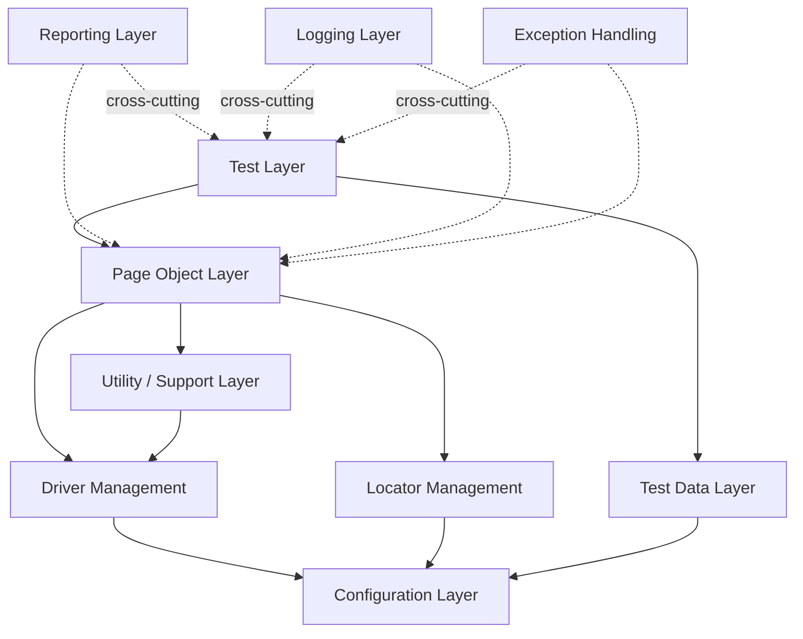
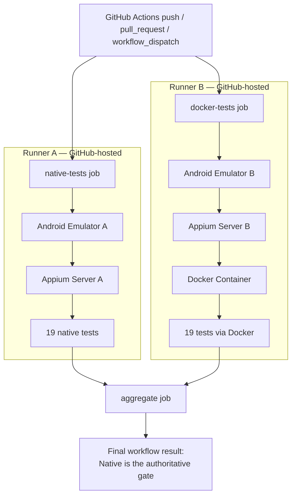

<div align="center">

# Enterprise Mobile Automation Framework

### Java · Appium · TestNG · Gradle · Docker · GitHub Actions

**A scalable Java + Appium mobile automation framework engineered for maintainability, CI/CD integration, containerized execution, and true parallel test execution.**

[](#20-release-history)
[](https://github.com/SharifulIslamSabuj/mobile-automation-framework/actions/workflows/mobile-automation.yml)
[](#6-technology-stack)
[](#6-technology-stack)
[](#6-technology-stack)
[](#6-technology-stack)
[](#9-docker-architecture)
[](#24-license)

</div>

<br>

---

## 1. Hero / Project Introduction

**Target application:** [Sauce Labs My Demo App (Android)](https://github.com/saucelabs/my-demo-app-android) — `com.saucelabs.mydemoapp.android`, exercised end-to-end through Appium's UiAutomator2 driver.

This is a layered Java automation framework governed by five versioned, cross-referenced engineering documents — requirements, test design, test cases, test data design, and a locator repository — all authored, audited, and frozen ahead of implementation. It automates 19 of 32 documented test cases, and its production CI pipeline runs that suite on **two independent, concurrently executing paths — a native GitHub-hosted runner and a Docker-based execution layer — as true parallel jobs**, not a simulated or sequential approximation of parallelism.

The project is built and documented as an intentionally evolving automation platform: foundation → CI/CD → containerized execution → true parallel execution, with a roadmap toward distributed and cloud execution described honestly as *planned*, not implemented.

---

## 2. Project Value Proposition

What distinguishes this repository from a typical automation project isn't a single feature — it's a set of engineering characteristics carried consistently from the framework layer through the CI pipeline:

- **Maintainable architecture** — one Page Object per screen, locators isolated into their own layer, a `ThreadLocal`-based driver manager, and a tiered configuration system, all governed by a frozen architecture document (MA-FA-001).
- **CI/CD integration** — every push and pull request to `main` runs the full suite on a real Android emulator via GitHub Actions.
- **Containerized execution** — a purpose-built Docker image runs the identical test suite as an independent validation path.
- **Execution isolation** — the native and Docker paths run on separate GitHub-hosted runners, each with its own Android emulator and Appium server; neither shares state with the other.
- **True parallel CI execution** — native and Docker jobs are scheduled with no dependency between them, confirmed to overlap in wall-clock time using real GitHub Actions job timestamps, not assumed from job structure alone (Section 10).
- **Result aggregation with an unweakened quality gate** — a dedicated `aggregate` job combines both results; the native path remains the sole authoritative pass/fail signal, and a Docker-side failure is always reported, never hidden or silently converted into a pass.
- **Artifact preservation** — JUnit XML, ExtentReports HTML, Allure results/report, screenshots, and logs are captured and uploaded independently for both execution paths on every run, pass or fail.

This is evidence-based language, not a claim of universal reliability. Section 19 states plainly what is *not* yet true of this project.

---

## 3. Current Release

<div align="center">

## v1.4.0 — Advanced Test Reporting & Quality Validation
### Main Feature: Allure Reporting Integration + ExtentReports Correctness Fixes

</div>

v1.4.0 builds on v1.3.0's scalable Native + Docker execution (Section 5.2, Section 10) by adding a second, independently generated reporting system alongside ExtentReports, and by correcting two ExtentReports status-accuracy defects. The execution architecture itself — native/Docker parallel jobs, the native-authoritative quality gate — is unchanged from v1.3.0; this release is scoped entirely to reporting.

Highlights, each independently evidenced by committed code and GitHub Actions Run #61 (GREEN):

- **Allure integrated into the build and CI pipeline** — the `io.qameta.allure` Gradle plugin, `allure-testng`, and `allure-bom` are wired into `build.gradle`; both `native-tests` and `docker-tests` upload their own Allure raw results, and a dedicated step merges them and generates one combined Allure report as a CI artifact, on every run.
- **Allure test steps across the full suite** — every `CommonAssertions` call reports as an Allure step with a PASSED/FAILED status, so step-level detail exists for all 19 tests, not a subset.
- **Allure test metadata — partial, not suite-wide.** `LoginTest` carries `@Epic`/`@Feature`/`@Story`/`@Severity` annotations; `CartTest`, `NavigationTest`, and `ProductDetailsTest` do not yet carry this metadata.
- **ExtentReports failure-status correctness** — a test that fails outside a `CommonAssertions` call (e.g. a raw `ElementActionException` from a Page Object) is now correctly marked failed in the Extent report, rather than left showing its last passing status.
- **ExtentReports skipped-status correctness** — a test skipped by a failed `@BeforeMethod` is now correctly marked skipped in the Extent report, rather than rendered as a false pass.
- **Cross-report validation, not assumed agreement** — GitHub Actions Run #61 confirmed TestNG (Native 19/19, Docker 19/19), Allure (19 total, 19 passed, 0 failed/broken/skipped), and ExtentReports (19/19 `pass` on both paths) all independently report the same outcome for the same run (Section 13).

---

## 4. Key Capabilities

| Capability | Status |
|---|:---:|
| Layered automation framework (config, driver, locator, page object, test layers) | Implemented |
| Page Object Model across 9 AUT screens | Implemented |
| Centralized, AUT-source-verified locator repository | Implemented |
| Tiered, environment-aware configuration | Implemented |
| GitHub Actions CI/CD on every push/PR | Implemented |
| Docker-based test execution layer | Implemented |
| True parallel Native + Docker CI execution | Implemented |
| Independent per-path artifact capture and reporting | Implemented |
| Native-authoritative, Docker-non-blocking quality gate | Implemented |
| Allure reporting (build + CI integration, test steps, partial metadata) | Implemented |
| Jenkins pipeline | Planned (v1.5.0) |
| Azure DevOps pipeline | Planned (v1.6.0) |
| Selenium/Appium Grid | Planned (v1.7.0) |
| BrowserStack integration | Planned (v1.8.0) |
| Sauce Labs cloud execution | Planned (v1.9.0) |
| iOS support | Planned (v2.0.0) |

---

## 5. Architecture

### 5.1 Framework Architecture

No architecture image is committed to this repository — the diagram below is generated directly from the framework's documented layer dependencies (MA-FA-001 §5, §24).



The Test Layer depends on the Page Object Layer, which depends on Driver Management, Locator Management, and the Utility layer — all of which ultimately depend on the Configuration Layer. Reporting, Logging, and Exception Handling are cross-cutting concerns available to every layer above them.

| Layer | Responsibility |
|---|---|
| Configuration | Supplies environment and execution values to every other layer |
| Driver Management | Owns the Appium/UiAutomator2 session lifecycle |
| Locator Management | Holds element locators, isolated from interaction logic |
| Utility / Support | AUT-agnostic reusable helpers — waits, gestures, scrolling, device control |
| Test Data | Supplies external test input, separated from test logic |
| Page Objects | One screen-level abstraction per AUT screen |
| Tests | TestNG classes expressing requirement-level verification |
| Reporting | Aggregates per-run, per-test outcomes (cross-cutting) |
| Logging | Records step-level execution activity (cross-cutting) |
| Exception Handling | Defines failure categories consumed by Logging and Reporting (cross-cutting) |

Full detail: [MA-FA-001 — Framework Architecture](docs/05-framework-architecture/MA-FA-001_Framework-Architecture_v1.1.md).

### 5.2 CI/CD Execution Architecture (v1.3.0)



`native-tests` and `docker-tests` have **no dependency on each other** in the workflow definition — that absence is what allows GitHub Actions to schedule them concurrently rather than sequentially. Each provisions its own emulator and Appium server on its own runner; neither shares infrastructure with the other. `aggregate` runs only after both complete and computes the final result from each job's real, independently captured exit code (Section 12).

---

## 6. Technology Stack

| Layer | Technology |
|---|---|
| Language | Java 17 |
| Build Tool | Gradle 9.0.0 (wrapper-pinned) |
| Automation | Appium Java Client 9.4.0 |
| Driver | UiAutomator2 |
| WebDriver Protocol | Selenium Java 4.25.0 |
| Test Runner | TestNG 7.10.2 |
| Reporting | ExtentReports 5.1.1 |
| Reporting (secondary) | Allure (`io.qameta.allure` Gradle plugin 4.1.0, `allure-testng`, `allure-bom` 2.35.3) |
| Logging | SLF4J 2.0.16 + Log4j2 2.24.1 |
| Configuration | Java Properties, tiered resolution |
| Test Data | JSON / YAML / Properties via Jackson 2.18.0 |
| Synthetic Data | DataFaker 2.4.3 |
| CI/CD | GitHub Actions |
| Containerization | Docker (test execution layer — see Section 9) |
| Architecture | Layered, Page Object Model |
| Design Pattern | Page Object Model · Factory (drivers, data) · Manager/Provider (driver, reporting) |
| Dependency Management | Gradle |
| Version Control | Git / GitHub |

Selenium/Appium Grid, BrowserStack, and Sauce Labs are **not** part of the current technology stack — they are roadmap items (Section 21).

---

## 7. Test Automation Scope

- **Platform:** Android only (real device and emulator profiles both supported — see `config-real-device.properties` / `config-emulator.properties`)
- **Automation tool:** Appium (UiAutomator2 driver) via Selenium WebDriver protocol
- **Language / runner:** Java 17, TestNG 7.10.2
- **Design pattern:** Page Object Model, one class per AUT screen
- **Reporting:** ExtentReports (HTML) with automatic failure screenshots, plus Allure step-level reporting generated for every run (Section 13); structured logs via SLF4J/Log4j2
- **Test data:** External JSON/YAML/Properties, resolved through one environment-aware interface
- **Execution strategy:** `ISOLATED` (AUT state reset per test method, used in CI) and `FAST` (state reuse, local debugging only)

This repository does not include API testing, performance testing, or web browser automation — the scope is Android mobile UI automation only.

---

## 8. CI/CD & Execution Architecture

Continuous integration runs via GitHub Actions (`.github/workflows/mobile-automation.yml`) on every push and pull request to `main`, and on demand via `workflow_dispatch`. Each of the three jobs (`native-tests`, `docker-tests`, `aggregate`) runs on a `ubuntu-24.04` GitHub-hosted runner.

| Execution Mode | Environment | Purpose |
|---|---|---|
| Local Native | Local machine, local emulator/device | Development and debugging |
| CI Native | GitHub-hosted runner, runner-provisioned emulator | Authoritative production quality gate |
| CI Docker | Docker container + GitHub-hosted runner's emulator | Independent, non-blocking validation |
| CI Parallel | `native-tests` and `docker-tests` running concurrently | True parallel validation (v1.3.0) |

See Section 16 for CI trigger and configuration details.

---

## 9. Docker Architecture

Docker is used as the **test execution layer** within the production CI environment. Verified directly from the repository's own `Dockerfile` and workflow:

> **The image contains only the Java 17 runtime and the Gradle test harness.** The Android emulator, ADB, and Appium server all remain on the GitHub-hosted CI runner and are never containerized. The container is not baked with project source — it runs with the repository bind-mounted read/write at `/workspace`, and reaches the runner's own Appium server over `--network=host`.

This is an intentional architectural boundary (documented as "Model 3" in `docs/docker/PHASE_19.2_DOCKER_ARCHITECTURE_SPECIFICATION.md`), not a limitation of the current implementation:

- ✅ Docker is the isolated, reproducible execution environment for the test harness itself.
- ✅ Docker uses a pinned base image (`eclipse-temurin:17-jdk-jammy`, pinned by digest) and a non-root user.
- ❌ The Android emulator is **not** inside the container.
- ❌ Appium is **not** inside the container.

**This is what is accurate today:** *"Docker is used as the test execution layer within the production CI environment, while Android emulator provisioning remains handled by the CI runner."* Claims of a fully self-contained "Android environment in Docker" would not reflect this repository's actual architecture.

---

## 10. Parallel Execution

### Sequential vs. True Parallel

**Sequential execution (pre-v1.3.0, Phase 19.5):** Native and Docker ran inside one job, on one runner, sharing one emulator and one Appium server. Docker's first command only began after native's test run had already finished. Total wall-clock time was their **sum**.

```
Native ────────────────► Docker ────────────────►
```

**True parallel execution (v1.3.0, Phase 19):** Native and Docker run as independent jobs on independent runners, each with its own emulator and Appium server. Neither waits for the other to start.

```
Native ──────────────────────►
                 (concurrent)
Docker ──────────────────────────►
```

### Evidence

Concurrency is not assumed from the workflow's job structure — it is confirmed using real GitHub Actions job start/end timestamps, across three independent production runs:

| Run | Native | Docker | Overlap | Total Duration |
|---|---|---|---|---|
| Phase 19 implementation validation | FAIL (0/19) | PASS (19/19) | 9m20s | 14m52s |
| Phase 19A supplemental confirmation | PASS (19/19) | FAIL (18/19) | 13m49s | 13m59s |
| Phase 19B additional observation | PASS (19/19) | PASS (19/19) | 13m40s | 14m21s |

Full evidence, including exact timestamps, JUnit results, and failure classification for each run: [`docs/docker/PHASE_19_TRUE_PARALLEL_EXECUTION_IMPLEMENTATION_REPORT.md`](docs/docker/PHASE_19_TRUE_PARALLEL_EXECUTION_IMPLEMENTATION_REPORT.md).

Three consecutive runs each independently confirmed direct, non-zero overlap between the two jobs' execution windows. This is not presented as a guaranteed duration for every future run — overlap length varies with runner provisioning time, emulator boot time, and CI queueing, all outside this project's control.

---

## 11. Performance

The Phase 19 implementation validation run measured a wall-clock improvement of **approximately 1.7×** compared with the prior sequential execution baseline (~25–27 minutes sequential vs. ~14m52s under true parallel execution).

**This is an observation from validation runs, not a guaranteed improvement.** Actual wall-clock time on any given run depends on GitHub-hosted runner availability and provisioning time, Android emulator boot time, CI queueing, and the specific tests executed. The three runs summarized in Section 10 show total durations ranging from 13m59s to 14m52s — a consistent range, not a fixed number.

---

## 12. Failure Semantics

| Condition | Native | Docker | Workflow Result |
|---|:---:|:---:|:---:|
| Both pass | PASS | PASS | **SUCCESS** |
| Native fails | FAIL | PASS or FAIL | **FAILURE** |
| Native passes, Docker fails | PASS | FAIL | **SUCCESS** |
| Both fail | FAIL | FAIL | **FAILURE** |

- **Native is the sole, authoritative blocking quality gate.** A native failure fails the workflow regardless of Docker's result.
- **Docker is independently observable, not authoritative.** Its real exit code is captured explicitly by the `docker-tests` job and read directly by `aggregate` — the job's own `continue-on-error: true` setting (used only so a Docker failure doesn't block the overall workflow run) is never mistaken for "Docker passed." All three rows above where Docker's real result appears have been directly, empirically observed in production runs (Section 10) — this is not a theoretical design.
- **Docker does not replace Native.** As of v1.3.0, Docker functions as an independently visible, non-blocking validation path — moving Docker to a blocking/primary role is an explicitly deferred decision (`docs/docker/PHASE_19.5C_FINAL_DOCKER_PRODUCTION_READINESS_REVIEW.md`), not yet made.

---

## 13. Reporting & Artifacts

This framework produces execution evidence at runtime, both locally and in CI, through two independently generated reporting systems — ExtentReports and Allure — alongside JUnit XML, screenshots, and structured logs.

| Artifact | Generated By | Location |
|---|---|---|
| HTML execution report | ExtentReports | `reports/` (local) — uploaded as part of CI artifacts |
| Allure raw results | Allure (`io.qameta.allure` Gradle plugin, wired into the `test` task) | `build/allure-results/` (local and CI) |
| Allure HTML report | `allureReport` Gradle task (CI) / standalone Allure CLI via the `allureLocalReport` task (local) | `build/reports/allure-report/allureReport/` (CI, Native+Docker merged) / `build/allure-report/` (local) |
| Failure screenshots | `ScreenshotManager` | `reports/screenshots/` |
| Structured execution logs | SLF4J + Log4j2 | `logs/` |
| JUnit XML | Gradle/TestNG | `build/test-results/test/` |

**Locally**, none of these are committed to the repository — `reports/`, `logs/`, `screenshots/`, and `build/` are runtime output, excluded via `.gitignore` and regenerated on every run.

**In CI**, both execution paths upload their own independent, non-overlapping artifact bundle on every run, pass or fail, via `actions/upload-artifact`:

| Path | Artifact Name |
|---|---|
| Native | `mobile-automation-run-<run-number>` |
| Native — Allure raw results | `allure-results-native-<run-number>` |
| Docker | `mobile-automation-docker-run-<run-number>` |
| Docker — Allure raw results | `allure-results-docker-<run-number>` |
| Combined Allure report (Native + Docker merged) | `allure-report-<run-number>` |

Neither execution path's artifact ever overwrites the other's — verified directly in the Phase 19 validation evidence (Section 10), not merely asserted by the workflow's design. Allure report generation is additive to ExtentReports, never a replacement, and is diagnostic only — it never affects the workflow's pass/fail result (Section 12 remains the sole authority on that).

**Reporting consistency validation:** GitHub Actions Run #61 confirmed all independently generated result signals agree on the same outcome for the same run — TestNG (Native 19/19, Docker 19/19), Allure (19 total, 19 passed, 0 failed/broken/skipped), and ExtentReports (19/19 `pass` on both paths).

**CURRENT:** ExtentReports HTML, Allure raw results and combined report, JUnit XML, failure screenshots, and structured logs — captured independently for both the native and Docker paths.

---

## 14. Quality Engineering Practices

Practices actually evidenced by this repository's implementation and CI history:

- **Page Object Model** — one class per AUT screen, locators isolated into a dedicated layer.
- **Centralized driver management** — `ThreadLocal`-based Appium/UiAutomator2 session lifecycle.
- **Requirement-to-code traceability** — every automated test case traces to a Functional Requirement and Test Scenario (Section 17).
- **CI/CD** — full suite executed on every push/PR via GitHub Actions.
- **Containerized execution** — an independently reproducible Docker test-execution layer.
- **True parallel execution** — independently scheduled, concurrently overlapping CI jobs (Section 10).
- **Independent result handling and artifact preservation** — separate, never-overwriting artifacts for each execution path, uploaded pass or fail.
- **Cross-report validation** — TestNG, Allure, and ExtentReports are confirmed to agree on the same outcome for the same CI run (Section 13), not assumed consistent by design.
- **Explicit failure classification discipline** — production failures are classified using a defined evidence standard (`VERIFIED` / `INFERRED` / `NOT VERIFIED` / `UNKNOWN`) rather than assumed; see Section 19.
- **Explicit, unweakened quality gates** — the native path's pass/fail status is never silently overridden by another path's result.
- **Controlled release/versioning** — annotated Git tags for each release, with evidence documents committed alongside the code they describe.

---

## 15. Project Structure

```
mobile-automation-framework/
├── docs/                          — Enterprise documentation (governance through test design)
│   ├── ci/                        — GitHub Actions CI/CD architecture, decisions, and verification (25 docs)
│   ├── docker/                    — Docker architecture, parallel execution design/implementation evidence (30 docs)
│   └── allure/                    — Allure/ExtentReports reporting implementation and validation evidence (19 docs)
├── src/
│   ├── main/java/.../framework/   — config, driver, locators, components, core, utils, data, models, reporting, logging, listeners, exceptions
│   └── test/
│       ├── java/.../framework/    — pages, tests, assertions
│       └── resources/
│           ├── config/            — Environment configuration profiles
│           ├── testdata/          — External JSON/YAML/Properties test data
│           └── log4j2.xml
├── .github/workflows/
│   └── mobile-automation.yml      — native-tests / docker-tests / aggregate CI pipeline
├── Dockerfile                     — Test execution layer image (Java 17 + Gradle only — see Section 9)
├── .dockerignore
├── build.gradle
├── settings.gradle
└── gradlew / gradlew.bat
```

`logs/` and `reports/` are generated at runtime and are not part of the committed structure.

---

## 16. Getting Started

**Prerequisites** — Java 17, Android SDK with `adb` on `PATH`, a running Appium server (default `http://127.0.0.1:4723`), and an Android device or emulator with `com.saucelabs.mydemoapp.android` installed.

```bash
# Clone
git clone https://github.com/SharifulIslamSabuj/mobile-automation-framework.git

# Build
./gradlew clean build
```

### 16.1 Local Execution

```bash
# Run the full suite
./gradlew test

# Run a single test class
./gradlew test --tests "com.mobileautomation.framework.tests.LoginTest"
```

The HTML report is written to `reports/` on completion — open the newest `AutomationReport_*.html` file in a browser.

### 16.2 Docker Execution (local, opt-in)

The Docker image is a local, opt-in test-execution harness — it still requires a running Android emulator and Appium server on the host (Section 9); it does not provide either itself.

```bash
docker build -t mobile-automation-harness:local .

docker run --rm --network=host \
  --user "$(id -u):$(id -g)" \
  -v "$(pwd):/workspace" \
  -w /workspace \
  mobile-automation-harness:local \
  ./gradlew test --no-daemon -Denv=emulator -Dapp.path=<absolute-path-to-apk>
```

### 16.3 CI Execution

The production workflow (`.github/workflows/mobile-automation.yml`) runs automatically on every push and pull request to `main`, and can also be triggered manually via `workflow_dispatch` from the Actions tab. It executes `native-tests` and `docker-tests` concurrently and reports the aggregated result — see Sections 8–12 for the full CI architecture.

---

## 17. Documentation Suite

A governing document set authored ahead of implementation and independently frozen:

| Document | ID | Version | Purpose |
|---|---|:---:|---|
| [Requirements Specification](docs/03-requirements/MA-RS-001_Requirements-Specification_v1.0.md) | MA-RS-001 | v1.8 | 31 functional requirements derived from AUT analysis |
| [Test Design Specification](docs/08-test-design/MA-TD-001_Test-Design-Specification_v1.0.md) | MA-TD-001 | v1.9 | 32 test scenarios, one or more per requirement |
| [Test Case Specification](docs/08-test-design/MA-TC-001_Test-Case-Specification_v1.0.md) | MA-TC-001 | v1.16 | 32 detailed test cases, automation status, traceability |
| [Test Data Design Specification](docs/08-test-design/MA-TDD-001_Test-Data-Design-Specification_v1.0.md) | MA-TDD-001 | v1.6 | Test data sources, formats, automation file mapping |
| [Locator Repository](docs/automation/LOCATOR_REPOSITORY.md) | MA-LOC-001 | v1.1 | Centralized, AUT-source-verified element locators |

All five were subjected to a whole-project consistency audit, a reconciliation pass, and an independent final re-verification, and were approved as an internally consistent, traceable baseline. The wider documentation set — governance, vision and scope, AUT analysis, test strategy, framework architecture, environment and tooling, test planning, execution and reporting, risk management, and glossary — lives under [`docs/`](docs/) (98 markdown documents in total, including 25 CI/CD documents under [`docs/ci/`](docs/ci/), 30 Docker/parallel-execution documents under [`docs/docker/`](docs/docker/), and 19 Allure/ExtentReports reporting documents under [`docs/allure/`](docs/allure/)).

---

## 18. Automation Coverage

<div align="center">

| 19 | 18 | 1 | 12 | 1 |
|:---:|:---:|:---:|:---:|:---:|
| **Automated** | **Dedicated** | **Incidental** | **Manual** | **Deferred** |

</div>

| Module | Total TCs | Automated | Manual | Deferred |
|---|:---:|:---:|:---:|:---:|
| Application Launch | 1 | 0 | 1 | 0 |
| Authentication | 3 | 1 | 2 | 0 |
| Product Browsing | 4 | 1 | 3 | 0 |
| Product Details | 5 | 4 | 1 | 0 |
| Cart | 5 | 5 | 0 | 0 |
| Checkout — Shipping | 3 | 3 | 0 | 0 |
| Checkout — Payment | 3 | 3¹ | 0 | 0 |
| Order Review | 1 | 0 | 1 | 0 |
| Order Placement | 2 | 1 | 1 | 0 |
| Navigation | 2 | 1 | 1 | 0 |
| Error Handling | 1 | 0 | 0 | 1 |
| State Management | 2 | 0 | 2 | 0 |
| **Total** | **32** | **19** | **12** | **1** |

¹ Two of the three Checkout — Payment cases have a dedicated test method; the third (TC-024) is verified through assertions inside another test's flow, without a dedicated method of its own, and is tracked separately as incidental coverage.

Coverage is never inferred from navigation alone, a successful click, or a method executing without exception — every automated classification traces to an explicit, business-meaningful assertion in code, across `LoginTest`, `NavigationTest`, `ProductDetailsTest`, and `CartTest`.

---

## 19. Known Limitations / Engineering Boundaries

<details>
<summary><strong>Third-party AUT reliability limitation</strong></summary>

The AUT (Sauce Labs My Demo App) exhibits an intermittent reliability limitation, investigated extensively in the Phase 19.4 series (`docs/docker/PHASE_19.4A_*` through `PHASE_19.4P_*`). What is and isn't claimed about it:

- The limitation is **external to this project's Docker architecture** and does not invalidate Docker's technical qualification (`docs/docker/PHASE_19.4L_*`, `PHASE_19.4O_*`).
- A verified AUT crash **always remains a failed test run** — it is never hidden, retried until green, or silently converted into a pass.
- Failures are classified using a defined evidence standard: a launcher screenshot or timeout alone is never sufficient for a `VERIFIED EXTERNAL_AUT_CRASH` classification — that requires both logcat `FATAL EXCEPTION` evidence and confirmed process termination (`docs/docker/PHASE_19.4M_*`). Where that evidence is unavailable (production CI does not currently capture it), failures are classified `INFERRED` or `UNKNOWN`, not upgraded past what the evidence supports.
- **AUT reliability is not claimed to be fixed.** The decision (Phase 19.4P, Option A) was to accept and document this as an external limitation, not to patch, fork, or replace the AUT.

</details>

<details>
<summary><strong>Docker architecture boundary</strong></summary>

Docker provides the **test execution layer** only. The Android emulator, ADB, and Appium server are provisioned by the GitHub-hosted CI runner, not by the container (Section 9). This is a deliberate architectural boundary, not a gap to be closed.

</details>

<details>
<summary><strong>Other current boundaries</strong></summary>

| Area | Status |
|---|---|
| Appium/Selenium Grid | Not implemented — single-emulator-per-job execution only |
| BrowserStack | Not integrated |
| Sauce Labs cloud execution | Not integrated |
| iOS support | Not implemented — Android only |
| Jenkins | Not integrated |
| Azure DevOps | Not integrated |
| Docker as primary/blocking gate | Not adopted — Docker remains independently observable and non-blocking by design (Section 12); this is an explicitly deferred decision, not an oversight |
| Rollback drill | The rollback path from v1.3.0's parallel architecture back to sequential execution is structurally simple (single-file diff) but has not been empirically drilled |
| Test coverage | 12 of 32 documented test cases remain manual; 1 is explicitly deferred |

</details>

---

## 20. Release History

| Version | Release Name | Main Feature | Status |
|---|---|---|:---:|
| v1.0.0-foundation | Foundation Milestone | Framework foundation (config, driver, core, cross-cutting layers) | Released |
| v1.0.0 | Foundation Release | Layered framework, Page Objects, 19 automated test cases, frozen documentation baseline | Released |
| v1.1.0 | CI/CD Release | GitHub Actions CI/CD, reproducibly green 19/19 baseline | Released |
| — | *(Docker execution layer)* | Docker test-execution image and CI integration (Phase 19.1–19.5) — delivered as part of v1.3.0 below; **no separate `v1.2.0` tag exists in this repository** | Delivered within v1.3.0 |
| v1.3.0 | Scalable Execution Release | True Parallel Native + Docker Execution | Released |
| v1.4.0 | Advanced Test Reporting & Quality Validation | Allure + ExtentReports + CI validation | Released |
| v1.5.0 | Enterprise CI Release | Jenkins Pipeline | Planned |
| v1.6.0 | Enterprise DevOps Release | Azure DevOps Pipeline | Planned |
| v1.7.0 | Distributed Execution Release | Selenium/Appium Grid | Planned |
| v1.8.0 | Cloud Execution Release | BrowserStack | Planned |
| v1.9.0 | Multi-Cloud Release | Sauce Labs | Planned |
| v2.0.0 | Cross-Platform Release | iOS Support | Planned |

The version sequence intentionally skips a standalone `v1.2.0` tag: Docker execution capability was developed (Phase 19.1–19.5) and integrated into production CI, then combined with true parallel execution and released together as `v1.3.0`. This is stated here explicitly rather than presenting a `v1.2.0` release that was never tagged.

### Project Evolution

| Milestone | Date | Description |
|---|:---:|---|
| Enterprise Framework Foundation | 2026-07-31 | Architecture, configuration, driver management, core utilities, cross-cutting infrastructure, base framework, and test data framework implemented and validated |
| Release v1.0.0 | 2026-08-05 | Page Object layer, test classes, and 19 automated test cases implemented; full documentation baseline audited and frozen |
| GitHub Actions CI/CD (v1.1.0) | 2026-08-07–08 | CI/CD architecture and workflow specification produced; `.github/workflows/mobile-automation.yml` implemented and iteratively stabilized to a reproducibly green 19/19 baseline |
| Docker Test Execution Layer | 2026-08-10 | Docker Model 3 architecture designed and implemented (`docs/docker/PHASE_19.1*`–`PHASE_19.3*`), integrated into production CI as a parallel, non-blocking validation path (Phase 19.5) |
| AUT Reliability Investigation | 2026-08-10–11 | Intermittent third-party AUT limitation investigated across Phase 19.4A–19.4P; formally classified, bounded, and accepted (Option A) without patching or replacing the AUT |
| True Parallel Execution (v1.3.0) | 2026-08-11–12 | Production workflow converted to independent, concurrently-scheduled `native-tests`/`docker-tests`/`aggregate` jobs; verified across three production runs with direct timestamp evidence; released as v1.3.0 |
| Advanced Test Reporting & Quality Validation (v1.4.0) | 2026-08-19 | Allure integrated into the build and CI pipeline (Gradle plugin, Allure steps via `CommonAssertions`, per-path raw-result upload, combined report generation); ExtentReports failure- and skipped-status accuracy corrected; TestNG, Allure, and ExtentReports cross-validated in agreement on GitHub Actions Run #61 (Native 19/19, Docker 19/19); released as v1.4.0 |

---

## 21. Roadmap

**Completed:** `v1.0.0` → `v1.1.0` → `v1.3.0` → `v1.4.0` *(Docker delivered within v1.3.0 — see Section 20)*

**Next:** `v1.5.0` — Jenkins Pipeline Integration

**Future:**

| Release | Feature |
|:---:|---|
| v1.6.0 | Azure DevOps Pipeline |
| v1.7.0 | Selenium/Appium Grid |
| v1.8.0 | BrowserStack Integration |
| v1.9.0 | Sauce Labs Integration |
| v2.0.0 | iOS Support |

Nothing beyond v1.4.0 is implemented today. This table describes intended future work only.

---

## 22. Why This Project Matters

This repository demonstrates a specific, evidenced progression rather than a static feature list:

```
Automation Foundation → CI/CD → Containerization → True Parallel Execution
    → Advanced Test Reporting → Enterprise CI (planned) → Distributed Execution (planned)
    → Cloud Testing (planned) → Cross-Platform Automation (planned)
```

Each completed step is backed by committed code, a real CI history, and — for the CI/Docker/parallel-execution and reporting work specifically — over seventy individual investigation, design, and validation reports under `docs/ci/`, `docs/docker/`, and `docs/allure/`, documenting not just what was built but what was tried, what failed, and why specific architectural decisions were made. That evidence trail is itself part of what this project is meant to demonstrate: an engineering process that investigates before implementing, and validates before declaring something done.

---

## 23. Contribution / Development Notes

This is currently a single-maintainer project (Section 25). There is no formal external contribution process yet. Engineers reviewing or extending this repository should start with:

- [MA-FA-001 — Framework Architecture](docs/05-framework-architecture/MA-FA-001_Framework-Architecture_v1.1.md) for the framework's layering rules
- [`docs/ci/`](docs/ci/) for the CI/CD pipeline's design history
- [`docs/docker/`](docs/docker/) for the Docker and true-parallel-execution design and validation history
- [`docs/allure/`](docs/allure/) for the Allure/ExtentReports reporting implementation and validation history
- Section 16 above for local setup

---

## 24. License

No `LICENSE` file currently exists in this repository. This project is intended to be released under the MIT License.

---

## 25. Final Project Summary

<div align="center">

### Md. Shariful Islam
**Senior QA Automation Engineer | SDET**

Specializing in:
Mobile Automation (Appium) · Selenium Framework Architecture · Java Test Automation · Enterprise Test Framework Design · API Testing · CI/CD Test Automation

[GitHub](https://github.com/SharifulIslamSabuj) · [Email](mailto:ss.cse.ru@gmail.com)

</div>

<div align="center">

*Enterprise Mobile Automation Framework — Release v1.4.0, Advanced Test Reporting & Quality Validation.*
*Native + Docker execute as independent, concurrently-scheduled CI jobs, each producing independently validated ExtentReports and Allure results; Native remains the authoritative quality gate. See [Roadmap](#21-roadmap) for planned work beyond v1.4.0.*

</div>
