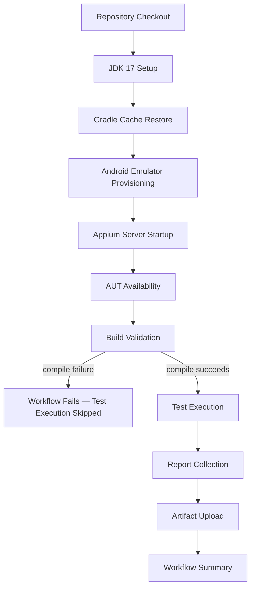

# MA-CICD-002 — GitHub Actions Workflow Specification

**Mobile Automation Framework**

| Field | Value |
|---|---|
| Document ID | MA-CICD-002 |
| Document Name | GitHub Actions Workflow Specification |
| Version | v1.0 |
| Status | Frozen — Implemented and Verified (with one corrected artifact-path error, see Version History) |
| Project | Mobile Automation Framework |
| Project Code | MA |
| AUT | Sauce Labs My Demo App (Android) |
| AUT Version | 2.2.0 |
| Platform | Android |
| Classification | Internal |

---

## Version History

| Version | Date | Author | Change Description |
|---|---|---|---|
| v0.1 | 2026-08-07 | Project Owner | Initial implementation-ready workflow specification, refining MA-CICD-001 into concrete job/step/trigger decisions for Phase 17.2 (YAML implementation). No YAML, no shell commands, no framework code produced. |
| v1.0 | 2026-08-08 | Project Owner | Implementation confirmed and independently verified (19/19 tests passing — see [Phase 17 Final Report](PHASE_17_FINAL_CI_BASELINE_QUALIFICATION_REPORT.md) and [Phase 18 Investigation Report](PHASE_18_CI_PARITY_INVESTIGATION_REPORT.md)). §11's "TestNG XML result output" row corrected below — Phase 17.2A's readiness assessment found the actual path (`build/test-results/test/`) differs from what this document originally specified (`test-output/`), and the implemented workflow uses the corrected path; this was the only factual correction implementation required against this document's original decisions. |

---

## Scope Note

This document contains no GitHub Actions YAML, no shell commands, and no implementation code. It is the last architectural document before implementation — everything a Phase 17.2 implementer needs to write the workflow file should be decided here, so that writing the YAML becomes a translation exercise, not a design exercise.

---

## 1. Executive Summary

### Purpose

MA-CICD-001 established *why* CI/CD is being introduced and the conceptual pipeline shape it must fit. This document exists to close every remaining open question MA-CICD-001 deliberately left for a later phase — the exact workflow file, its triggers, its runner, its jobs, its permissions, and, most critically, how a suite whose only verified execution evidence is a real physical device will run on a GitHub-hosted runner that has no physical device attached.

### Relationship with MA-CICD-001

MA-CICD-001 is the architecture; this document is its refinement into an implementation-ready specification. Every decision already made in MA-CICD-001 is carried forward unchanged here, not re-opened:

- Triggers: `push` to `main`, `pull_request`, `workflow_dispatch` (MA-CICD-001 §6) — refined in Section 4 below.
- No smoke/regression split, no pipeline-level retry (MA-CICD-001 §9, §11) — carried forward and reinforced in Sections 10 and 12.
- Artifact set: ExtentReports, logs, screenshots, Gradle report, TestNG XML (MA-CICD-001 §10) — refined into naming and retention detail in Section 11.
- No secrets required until a future release introduces a provider that needs them (MA-CICD-001 §12) — refined in Section 13.

Where MA-CICD-001 identified an *open question* rather than a decision — most notably the Android target for a GitHub-hosted runner (MA-CICD-001 §5, §15) — this document makes the concrete design decision that MA-CICD-001 was scoped not to make.

### Scope

The single GitHub Actions workflow for v1.1.0: build validation and full-suite test execution of the framework exactly as it exists today (19 automated test cases, 4 test classes), triggered by `push`, `pull_request`, and `workflow_dispatch`, executed against an Android emulator on a GitHub-hosted runner, with reports/logs/screenshots preserved as artifacts.

### Out of Scope

- Any YAML file content (Phase 17.2).
- Docker, parallel execution, Jenkins, Azure DevOps, Grid, BrowserStack, Allure, Sauce Labs, or iOS support — all remain future-release concerns per MA-CICD-001 §14, extended in Section 15 below.
- TestNG group/suite design (smoke vs. regression) — explicitly excluded per this phase's own instruction and consistent with MA-CICD-001 §9.
- Release, tag, and scheduled-workflow design — deferred, per Section 4.
- APK build/signing — the AUT is a pre-built third-party application, not something this repository compiles.

---

## 2. Workflow Overview

The logical sequence from commit to completion, expressed as an execution narrative rather than a diagram of jobs (Section 8 provides the diagram):

1. A developer pushes a commit to `main`, or opens/updates a pull request.
2. GitHub Actions detects the matching trigger (Section 4) and schedules a workflow run on a GitHub-hosted Linux runner (Section 5).
3. The runner checks out the repository at the triggering commit.
4. JDK 17 is provisioned on the runner, matching the framework's `build.gradle` toolchain declaration.
5. The Gradle dependency and wrapper cache is restored, if a prior run left one.
6. An Android emulator is provisioned and brought to a booted, ready state (Section 14) — this is the step MA-CICD-001 flagged as the pipeline's central open question, resolved concretely in this document.
7. An Appium server is started and confirmed reachable, since the framework's driver layer (`AndroidDriverFactory`) expects one at `appium.serverUrl` (default `http://127.0.0.1:4723`, per `config.properties`).
8. The application under test is made available to the emulator session (Section 14 — APK sourcing).
9. The framework is built via the Gradle wrapper; a compile failure halts the run before any test executes (MA-CICD-001 §8's "Fail Fast" principle).
10. The full suite executes via the same `./gradlew test` invocation documented in the project's own Getting Started instructions — no CI-only test command is introduced.
11. Reports (ExtentReports HTML, Gradle's own test report, TestNG XML output), logs, and any failure screenshots are collected from their existing, already-documented output locations (`reports/`, `logs/`).
12. Every collected artifact is uploaded, regardless of whether the run passed or failed.
13. A workflow summary surfaces the pass/fail outcome and key run statistics directly on the commit or pull request, without requiring a reviewer to open individual artifacts to know the result.

No step above introduces a framework capability that does not already exist; each step provisions an environment condition (JDK, emulator, Appium server, network reachability) the framework already assumes when run locally.

---

## 3. Workflow File Definition

| Property | Recommendation | Justification |
|---|---|---|
| Filename | `ci.yml` | Short, conventional, and accurately scoped — this workflow's only responsibility in v1.1.0 is continuous integration (build + test), not release or deployment; a name like `release.yml` or `pipeline.yml` would overstate its current scope |
| Location | `.github/workflows/ci.yml` | The only location GitHub Actions recognizes for workflow discovery — not a design choice, a platform requirement |
| Naming Convention | One workflow file per concern, named for that concern (`ci.yml` today; a hypothetical future `release.yml` would be named for its own concern, not appended to this one) | Keeps each workflow file's purpose readable from its filename alone, without needing to open it |
| Workflow Strategy: Single vs. Multiple | **Single workflow (`ci.yml`) for v1.1.0** | The current scope — build and test on push/PR — is one coherent concern with one trigger set and one artifact set (Section 11). Splitting it into multiple workflows today (e.g. a separate "build" workflow and "test" workflow) would require passing build output between workflows, which is strictly more complex than keeping them as ordered steps within one job (Section 7), for zero present benefit |

**Future workflow strategy:** additional workflow files are expected to be introduced *alongside* `ci.yml`, not by growing it indefinitely — for example, a `release.yml` once MA-CICD-001 §13's tag/release relationship is implemented, or a `docker-build.yml` if v1.2.0's containerization introduces its own build concern. This mirrors MA-CICD-001 §4's "Single Source of Truth" principle applied at the file level: each workflow file remains the single source of truth for one concern.

---

## 4. Trigger Specification

| Trigger | v1.1.0 Decision | Configuration Intent (not YAML) |
|---|---|---|
| `push` | Included | Fires on push to `main` only — this is the protected, always-green branch (MA-CICD-001 §7); pushes to other branches are covered by `pull_request` once a PR is opened against them |
| `pull_request` | Included | Fires when a pull request is opened against `main` or updated with new commits — verifies the change before merge, while it is still cheap to fix |
| `workflow_dispatch` | Included | Manual trigger, no required inputs for v1.1.0 — lets the pipeline be re-run against a specific commit on demand, valuable while the workflow is new and its emulator-based execution path (Section 14) is still being trusted |

### Why `schedule`, `release`, and `tag` are explicitly deferred

- **`schedule`** — a scheduled run only earns its cost once there is something worth detecting that a code-triggered run would not catch (e.g. drift in an external dependency or cloud device provider the framework does not yet depend on). With a single branch, no cloud dependency, and pinned dependency versions (`build.gradle`), nothing changes between commits — a nightly run today would either pass identically to the last `push` run or fail for a purely infrastructure reason (e.g. a transient runner issue), neither of which justifies the added GitHub Actions usage. Reconsider once v1.7.0/v1.9.0 introduce a cloud device provider whose availability the framework does not control.
- **`release`** — meaningful only once MA-CICD-001 §13's tag → release relationship is implemented. No tag or GitHub Release exists in this repository today (verified: zero tags). A `release` trigger configured against a process that does not yet exist would fire on nothing and verify nothing.
- **`tag`** (tag-push trigger) — same reasoning as `release`; introducing a tag-triggered workflow before the project has a tagging convention would create a trigger with an undefined job.

All three remain candidates for a *future, separate* workflow file (Section 3's "future workflow strategy"), not for `ci.yml`.

---

## 5. Runner Strategy

| Property | Decision | Justification |
|---|---|---|
| Runner Type | GitHub-hosted | No self-hosted infrastructure exists for this project today (MA-CICD-001 §2); a GitHub-hosted runner requires zero setup or maintenance and matches the project's current operational scale |
| Operating System | Linux | Android emulator acceleration on GitHub Actions is most reliably available on Linux runners via hardware-accelerated virtualization (KVM); this is the standard environment the Android tooling ecosystem targets for CI-based emulator execution |
| Runner Image | The current GitHub-hosted Ubuntu LTS image (`ubuntu-latest` at time of implementation) | Standard, actively maintained GitHub-provided image; using the `-latest` alias keeps the runner image current without this specification needing to be revised each time GitHub updates its default. Phase 17.2 should pin an explicit version (e.g. `ubuntu-24.04`) rather than trust `-latest` verbatim, so a future GitHub-side image change cannot silently alter CI behavior — that pinning decision is an implementation detail, recorded here as a requirement, not a value |
| Why GitHub-hosted (not self-hosted) | No physical Android device or persistent infrastructure is owned by this project; a self-hosted runner would need to be provisioned, secured, and maintained for a workload GitHub-hosted runners already satisfy (an emulator, not a physical device) | Avoids introducing infrastructure the project has no operational capacity to maintain, consistent with MA-CICD-001's "no pipeline-specific code path or infrastructure beyond what the framework already needs" |

**Future migration path:** a self-hosted runner becomes relevant only if a future need requires infrastructure GitHub-hosted runners cannot provide — and the roadmap does not appear to create that need: physical/cloud device access is already routed through dedicated providers (BrowserStack v1.7.0, Sauce Labs v1.9.0) rather than a self-hosted device farm. Self-hosted runners are therefore not anticipated as a requirement on the current roadmap, but remain an option if a future release introduces a workload (e.g. sustained parallel/Grid execution at a scale GitHub-hosted runners cannot cost-effectively support) that changes this calculus.

---

## 6. Permissions Strategy

**Least-privilege philosophy:** the workflow's `GITHUB_TOKEN` should be granted only the permissions its steps actually use, explicitly declared rather than left at the platform default (which for many repository configurations grants broader read/write access than this workflow needs). An unused permission is not a convenience held in reserve — it is unexamined attack surface.

| Permission Scope | v1.1.0 Requirement | Reasoning |
|---|---|---|
| `contents` | `read` | The workflow only needs to check out repository content; it never commits, pushes, or modifies repository contents |
| `pull-requests` | Not granted | The workflow does not comment on, label, or modify pull requests — status is surfaced through the standard commit/check status mechanism, which does not require this scope |
| `checks` | Not explicitly required beyond the default status reporting GitHub Actions performs automatically | No custom check-run annotations are planned for v1.1.0 |
| `actions` | Not granted | The workflow does not need to read or cancel other workflow runs |
| `packages` | Not granted | Nothing is published to GitHub Packages |
| `deployments` | Not granted | This workflow does not deploy anything — it builds and tests |
| `id-token` | Not granted | No OIDC-based cloud authentication is needed in v1.1.0 (no cloud device provider is integrated yet — Section 13) |

**Recommendation:** the workflow should declare `contents: read` explicitly and grant nothing else, rather than relying on repository-level default permissions. This should be revisited only when a future capability (e.g. an OIDC-authenticated connection to a cloud device provider in v1.7.0/v1.9.0) has a concrete, named reason to need more.

---

## 7. Job Design

v1.1.0 is designed as **one job composed of ordered steps**, not multiple parallel jobs (justified in Section 8). Each logical step below corresponds to one responsibility:

| Step | Responsibility |
|---|---|
| Repository Checkout | Fetch the triggering commit's full working tree, including the Gradle wrapper and its properties file |
| JDK 17 Setup | Provision a Java 17 runtime matching `build.gradle`'s declared toolchain |
| Gradle Cache Restore | Restore the Gradle dependency and wrapper distribution cache from a prior run, keyed to `build.gradle` and `gradle-wrapper.properties`, to reduce redundant downloads (Section 9) |
| Android Emulator Provisioning | Create and boot an Android Virtual Device matching the framework's `emulator` execution profile, to a state where `adb` reports it as ready (Section 14) |
| Appium Server Startup | Start an Appium server and confirm it is reachable at the address the framework's `DriverManager` expects (`appium.serverUrl`) before any test attempts to connect |
| AUT Availability | Make the target APK available to the session per Section 14's app-path resolution |
| Build Validation | Compile the framework (`src/main` and `src/test`) via the Gradle wrapper; halt here on any compile failure |
| Test Execution | Run the full suite via the same invocation documented in the project's Getting Started instructions — no CI-only test command (Section 10) |
| Report Collection | Confirm the expected report/log/screenshot output locations (`reports/`, `logs/`) contain the current run's output before the workflow attempts to upload them |
| Artifact Upload | Upload the collected reports, logs, and screenshots as workflow artifacts (Section 11), unconditionally — whether the run passed or failed |
| Workflow Summary | Publish a concise pass/fail summary (test counts, duration, links to uploaded artifacts) to the workflow run's summary view |

---

## 8. Job Execution Order

**Why a single job, sequentially ordered:** every step after Android Emulator Provisioning depends on the emulator and Appium server being reachable from the same runner filesystem and network namespace the test execution step runs in. Splitting these into separate jobs would require explicitly passing the emulator/Appium session, or the built artifacts, between jobs — GitHub Actions jobs do not share runtime state by default, only artifacts explicitly uploaded and re-downloaded. That indirection buys nothing at this scale (one Android target, one test suite, ~19 test cases) and would only become justified once genuine parallelism is introduced (v1.3.0, Section 15).

**Why Build Validation gates Test Execution:** this operationalizes MA-CICD-001 §4's "Fail Fast" principle concretely — there is no value in booting an emulator and starting Appium only to discover the code does not compile. (Emulator/Appium provisioning is sequenced *before* Build Validation here because both are environment setup with no dependency on the build's success — provisioning them in parallel with the build, where the CI implementation allows it, is a valid optimization left to Phase 17.2, not a change to this logical order.)

---

## 9. Gradle Strategy

| Concern | Specification |
|---|---|
| Wrapper Usage | The committed `gradlew` (and `gradlew.bat`, not used in a Linux runner context) is the only permitted invocation mechanism — never a runner-provided or manually installed Gradle. This guarantees the pinned Gradle 9.0.0 (`gradle/wrapper/gradle-wrapper.properties`) is what actually executes |
| Dependency Download | Standard Gradle dependency resolution against Maven Central, exactly as declared in `build.gradle`'s `repositories`/`dependencies` blocks — no CI-specific repository or dependency override is introduced |
| Build Validation | Achieved by invoking a Gradle task that triggers compilation (e.g. the framework's own `compileJava`/`compileTestJava` tasks, which Gradle's task graph already runs ahead of `test`) — this requires no additional Gradle configuration, since Gradle already will not run `test` without first compiling successfully |
| Compile Validation | Same mechanism as Build Validation above — Gradle's task dependency graph makes this automatic, not something the workflow must engineer separately |
| Cache Usage | The Gradle dependency cache (`~/.gradle/caches`) and wrapper distribution cache (`~/.gradle/wrapper`) should be restored/saved keyed on a hash of `build.gradle` and `gradle-wrapper.properties`, so a cache is invalidated exactly when a dependency or wrapper version actually changes — not on every run, and not stale after a real change |
| Future Optimization | Gradle's build cache and configuration cache are not recommended for v1.1.0 — at 90 main-source classes and 4 test classes, build time is not a bottleneck this project has evidence of. Revisit once the codebase or suite grows enough that build/compile time measurably affects O3 (fast feedback, MA-CICD-001 §3) |

---

## 10. Test Execution Strategy

The framework executes in CI **exactly as it exists today** — no TestNG groups, no smoke suite, no regression suite are introduced by this document or its implementation.

| Property | Specification |
|---|---|
| Command | The same full-suite invocation already documented in this project's own Getting Started instructions (`./gradlew test`) — the workflow introduces no alternate or CI-only test command |
| Scope | All 4 existing test classes, all 19 automated test cases, every run — there is no subset selection mechanism in the framework today (verified: no `groups = {...}` usage anywhere in the test classes, no TestNG suite XML exists), so "the suite" has exactly one meaning |
| Class Selection | None — the whole suite runs as a single Gradle `test` task invocation, matching local developer usage |
| Retry | Governed entirely by the framework's existing `RetryAnalyzer`/`execution.retryCount` configuration (MA-CICD-001 §11) — the workflow adds no pipeline-level retry on top of it |

### Future Evolution

If a future test-design phase introduces TestNG groups (e.g. tagging test methods as `@smoke`/`@regression`, distinct from today's descriptive-only `Execution Tags` in MA-TC-001), this workflow's Test Execution step (Section 7) is the only place that would need to change — from "run the full suite" to "run a selected group" — with no change required to any other step, trigger, or job boundary. Until that framework-level change exists, introducing group-based selection in the workflow would reference a capability the framework does not have, which this phase's own instructions explicitly prohibit.

---

## 11. Artifact Strategy

| Artifact | Source | Path | Included in v1.1.0? |
|---|---|---|---|
| ExtentReports HTML | `ExtentReportManager` | `reports/AutomationReport_*.html` | Yes |
| Gradle test report | Gradle's built-in HTML test reporter | Gradle's standard report output directory | Yes |
| TestNG XML result output | Gradle's built-in JUnit-format XML reporter (not `test-output/` as originally specified here — corrected v1.0, see Version History) | `build/test-results/test/` (gitignored via `build/`) | Yes |
| Structured execution logs | Log4j2, via `LogManager` | `logs/` | Yes |
| Failure screenshots | `ScreenshotManager` | `reports/screenshots/` | Yes |
| Allure results | Not applicable — Allure is a v1.8.0 capability | — | No |
| Execution videos | Not applicable — no recording capability exists | — | No |

### Naming Convention

Each run's artifact bundle should be named to include the workflow run identifier (e.g. the platform-provided run number/ID), so that artifacts from different runs are never ambiguous and never overwrite one another — this directly satisfies MA-CICD-001 §4's "Immutable Artifacts" principle. The framework's own report files are already self-timestamped (`AutomationReport_<timestamp>_<id>.html`), which composes cleanly with a run-scoped artifact bundle name rather than conflicting with it.

### Directory Structure

Artifacts should be uploaded preserving their existing relative structure (`reports/`, `reports/screenshots/`, `logs/`) rather than flattened into a single directory — this keeps a downloaded artifact bundle immediately recognizable to anyone already familiar with how the framework organizes its local output.

### Retention Policy

Retain artifacts for GitHub Actions' standard default retention window rather than a shortened custom period. Storage cost is not a constraint this project has encountered, and a shorter window risks deleting exactly the evidence a delayed PR review or a post-hoc interview reference would need. Retention period is a configuration value set at implementation time (Phase 17.2), not an architectural decision this document needs to fix precisely.

---

## 12. Failure Strategy

| Concern | Specification |
|---|---|
| Build Failure | A compile failure halts the workflow before Test Execution (Section 8); the workflow reports failure at the Build Validation step, and no test report is expected to exist for that run |
| Test Failure | Gradle's `test` task, by default, executes every discovered test method regardless of an earlier method's failure within the same task invocation (no `failFast` behavior is configured in `build.gradle` today) — so one failing test case does not prevent the remaining 18 from executing and reporting their own outcome. The overall Gradle task — and therefore the workflow — is marked failed if any test failed, but the evidence for all 19 is still produced |
| Artifact Preservation | Reports, logs, and screenshots (Section 11) are uploaded unconditionally — on success and on failure alike. A failed run's evidence is more valuable than a passed run's, and must never be silently dropped because the workflow treated "upload" as a success-only step |
| Workflow Status | The commit/pull request status reflects the workflow's actual outcome (pass/fail) with no override — a failing test always produces a failing workflow status, never a soft warning |
| Exit Behavior | The workflow's final state is determined solely by Build Validation and Test Execution outcomes — no step is permitted to swallow a failure and allow the workflow to report success regardless |
| Retry Policy | None beyond the framework's existing `RetryAnalyzer` (MA-CICD-001 §11, reaffirmed here). No pipeline-level retry, no automatic re-run on failure — a flaky result should be visible, not hidden behind a second retry layer stacked on top of the first |

---

## 13. Environment Strategy

| Concern | v1.1.0 Requirement | Future Requirement |
|---|---|---|
| Environment Variables | None required beyond what the framework's existing tiered configuration already resolves by default (e.g. `execution.mode=EMULATOR` is already the default profile when `-Denv` is unset, per `config-emulator.properties`) | — |
| Secrets | **None required for v1.1.0.** No credential is needed to run an emulator-targeted, locally-hosted Appium session — this matches MA-CICD-001 §12's principle that no credential is provisioned before the release that consumes it exists | — |
| Future — BrowserStack (v1.7.0) | Not applicable | Credentials (username/access key) stored as GitHub Secrets, injected as environment variables at the point the framework's existing `ConfigReader` system-property precedence already expects them — no new credential mechanism |
| Future — Sauce Labs (v1.9.0) | Not applicable | Same pattern as BrowserStack |
| Future — Azure DevOps (v1.5.0) | Not applicable | If Azure DevOps becomes an additional CI runner (not a credential the GitHub Actions workflow itself needs), any Azure-side credentials belong to that platform's own pipeline definition, not to `ci.yml` |

**Current requirement, stated plainly:** v1.1.0 needs zero secrets. This is a direct, favorable consequence of targeting a local emulator rather than a cloud device provider — it also means the workflow's Section 6 permissions and secret surface stay minimal until a real, named reason (a specific future release) requires otherwise.

---

## 14. Emulator Strategy

This section exists because MA-CICD-001 identified it as the single largest open question (MA-CICD-001 §15) and did not resolve it — resolving it is this document's central responsibility.

### Existing Validated Environment

Every piece of runtime evidence this framework has produced to date — the evidence behind its 19 automated test cases' Confirmed/Partially Confirmed verification status in MA-TC-001, and behind MA-LOC-001's locator verification — was captured against a **real, physical Android device**, using the `real-device` configuration profile (`config-real-device.properties`), where `device.name`, `platform.version`, and `device.udid` are supplied at execution time and intentionally left blank in source control.

### Future CI Execution Environment

GitHub-hosted runners (Section 5) do not have a physical Android device attached and cannot. The only feasible Android target for this workflow is an **Android Virtual Device (emulator)**, booted on the runner itself using Linux KVM-backed hardware acceleration.

The framework already has a configuration profile for this: `config-emulator.properties`, active by default (`-Denv=emulator` is the default when `-Denv` is not supplied at all). Two gaps in that profile need to be resolved by Phase 17.2, not invented here:

1. **`platform.version`** is intentionally blank in the committed profile ("depends on which system image the local AVD was created with"). CI must supply a concrete Android version matching whatever system image the emulator-provisioning step creates.
2. **`device.name=emulator-5554`** is the conventional ADB serial for the first AVD instance and is a reasonable default, but Phase 17.2 must confirm it matches whatever the chosen emulator-provisioning mechanism actually assigns before relying on it unmodified.
3. **`app.path`** is blank by default; `config.properties`'s own comment already anticipates this exact situation ("override this key in a future cloud/CI-specific profile"). Since the AUT is a pre-built third-party application (Sauce Labs My Demo App) that this repository does not compile, Phase 17.2 must decide where the CI-executed APK comes from — this specification does not select a specific source or URL, since that is an implementation decision requiring verification against MA-LOC-001's frozen AUT source commit, not an architectural one.

### Why CI Execution Must Be Treated as Parity Verification, Not Assumed Equivalence

A test passing on a real physical device does not guarantee it passes identically on an emulator, and the reverse is equally untrue. Real devices and emulators can differ in rendering timing, animation duration, keyboard behavior, permission dialog timing, and — occasionally — in resource-id resolution for dynamically rendered elements. This framework's entire locator repository (MA-LOC-001) and its explicit-wait-only synchronization strategy were built and tuned against real-device behavior specifically.

Therefore: the first several CI runs on the emulator target should be treated as a **verification exercise in their own right** — comparing emulator-based outcomes against the existing real-device evidence already documented in MA-TC-001 — not as an assumption that a CI pass automatically reconfirms the real-device baseline. Any test that behaves differently under the emulator (timing-sensitive failures, a wait that needs to be lengthened, a locator that resolves differently) must be **investigated and documented**, consistent with this project's evidence-first discipline (MA-CICD-001 §4) — never silently patched by loosening an assertion or increasing a wait without recording why.

---

## 15. Future Extension Points

| Release | What It Adds | Which Step/Section of This Workflow It Touches | Why No Redesign Is Required |
|---|---|---|---|
| v1.2.0 — Docker | Containerized execution environment | Build Validation and Test Execution steps (Section 7) run inside a container instead of directly on the runner OS | The step sequence (Section 8) and its dependencies are unchanged — only *where* those two steps execute changes |
| v1.3.0 — Parallel Execution | Concurrent test execution | Test Execution (Section 7, Section 10) becomes multiple concurrent instances instead of one sequential step; the framework's `ThreadLocal` driver design already anticipates this | Every other step (checkout, JDK setup, emulator/Appium provisioning, artifact upload, summary) is unaffected |
| v1.4.0 — Jenkins | An additional CI runner | The same job/step sequence (Section 7) is re-expressed in Jenkins' own job model | This document's logical design (Sections 7–12) is CI-product-agnostic by construction — it describes responsibilities, not GitHub Actions syntax |
| v1.5.0 — Azure DevOps | Another additional CI runner | Same reasoning as Jenkins | Same |
| v1.6.0 — Selenium/Appium Grid | Distributed device execution | Android Emulator Provisioning (Section 7, Section 14) is replaced by a Grid target-resolution step | Every downstream step (Appium connection, test execution, artifact upload) is unaffected, since they only depend on a reachable Appium session, not on how that session's device was provisioned |
| v1.7.0 — BrowserStack | Cloud device provider | Same replacement point as Grid (Emulator Provisioning step), plus Section 13 gains real secret values for a pattern already defined | No new credential mechanism, no new job/step boundary |
| v1.8.0 — Allure | Additional reporting format | Artifact Strategy (Section 11) gains one additional artifact row; Report Collection step (Section 7) gains one more report type to confirm | No structural change to any other step |
| v1.9.0 — Sauce Labs | Cloud device provider | Same as BrowserStack | Same |
| v2.0.0 — iOS | A second platform | Section 14's Android-specific provisioning becomes one of two platform-specific provisioning steps, selected the same way `emulator`/`real-device` already select an Android profile today | Extends the framework's existing environment-driven configuration pattern (MA-CICD-001 §2) rather than introducing a new one |

Consistent with MA-CICD-001 §14: every future release changes what fills a step, or what a step's target is — never the step sequence itself.

---

## 16. Definition of Done

Exit criteria that must be true before Phase 17.2 (YAML implementation) may begin:

1. This document has been reviewed against MA-CICD-001 and no decision here contradicts a decision already made there.
2. Section 14's two open gaps (`platform.version`, `app.path` / APK source) have concrete answers, decided by whoever implements Phase 17.2, using this document's stated constraints.
3. The runner image (Section 5) has been pinned to a specific version rather than left as `-latest`, per Section 5's own recommendation.
4. The permissions block (Section 6) is agreed as `contents: read` only, with no broader default accepted silently.
5. The artifact retention period (Section 11) has a concrete value selected, even though this document does not mandate one.
6. No `.github/workflows/` file exists in the repository yet — confirming this phase was produced as specification-only.
7. This document is committed under `docs/ci/`, alongside MA-CICD-001, and cross-referenced from the project's documentation index.

---

## 17. Review Checklist

- [ ] Every decision in this document is consistent with MA-CICD-001 — nothing here contradicts the approved architecture.
- [ ] No section contains YAML, shell commands, or GitHub Actions syntax.
- [ ] Section 14 (Emulator Strategy) clearly distinguishes the real-device baseline from the emulator-based CI target, and does not imply the two are already proven equivalent.
- [ ] Every job/step in Section 7 maps to a concrete, already-existing framework behavior or configuration — none invents a capability the framework does not have.
- [ ] Section 10 confirms no TestNG groups, smoke suite, or regression suite are introduced, per this phase's explicit instruction.
- [ ] Section 12 confirms no pipeline-level retry is introduced beyond the framework's existing `RetryAnalyzer`.
- [ ] Section 15 demonstrates, for every roadmap release (v1.2.0–v2.0.0), which specific step or section absorbs that release's change, with no redesign implied.
- [ ] Section 13 confirms zero secrets are required for v1.1.0, and that the future-secret pattern reuses the framework's existing configuration precedence rather than inventing a new one.
- [ ] Document follows the same Document Control / Version History / Approval structure as MA-CICD-001 and the rest of the documentation baseline.
- [ ] Nothing in this document is written as though it is already implemented — every capability described is either "as it exists today" (Sections 2, 9, 10, 13) or explicitly a decision for Phase 17.2 to execute (Sections 3, 5, 6, 11, 14, 16).

---

## Approval

| Role | Name | Status | Date |
|---|---|---|---|
| Prepared By | Project Owner / Repository Maintainer | Submitted | 2026-08-07 |
| Reviewed By | Pending | Pending | — |
| Approved By | Pending | Pending | — |
| Document Status | Frozen — Implemented and Verified | — | 2026-08-08 |

---

**End of Document — MA-CICD-002, v1.0**
