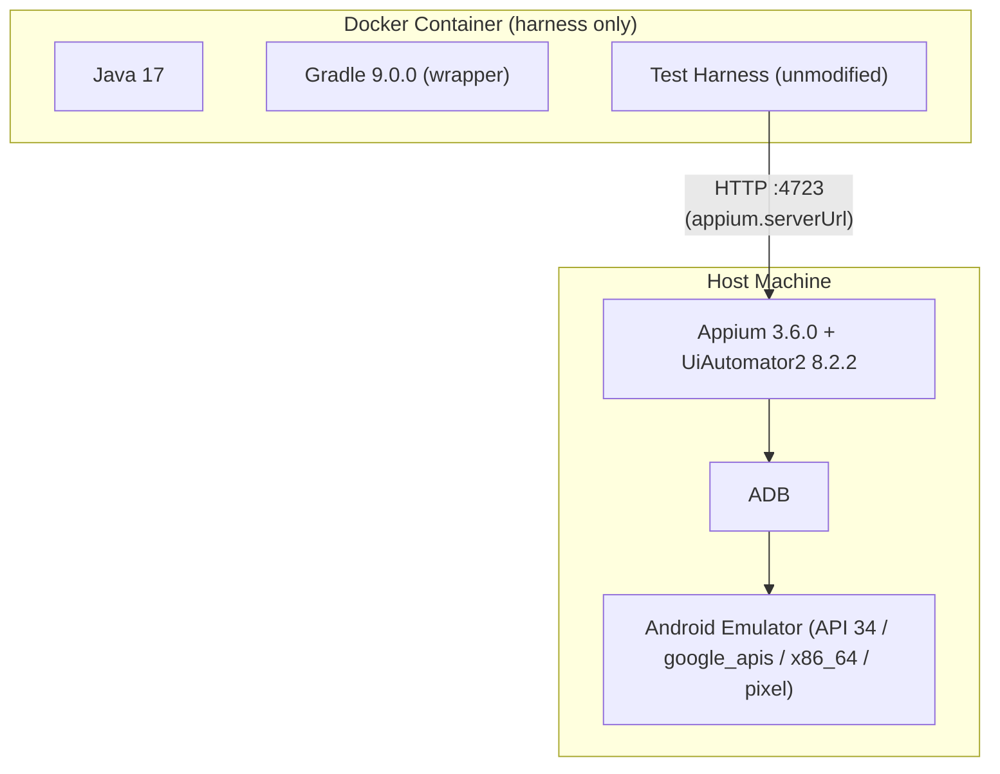
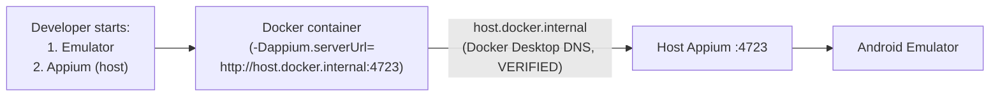
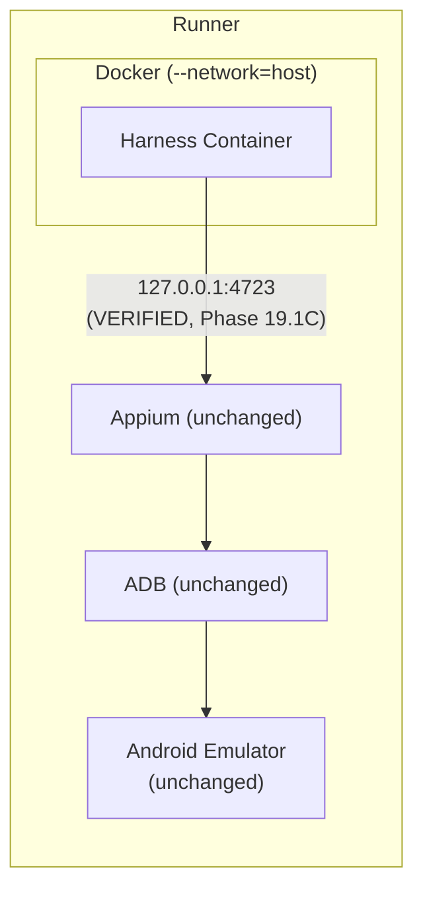
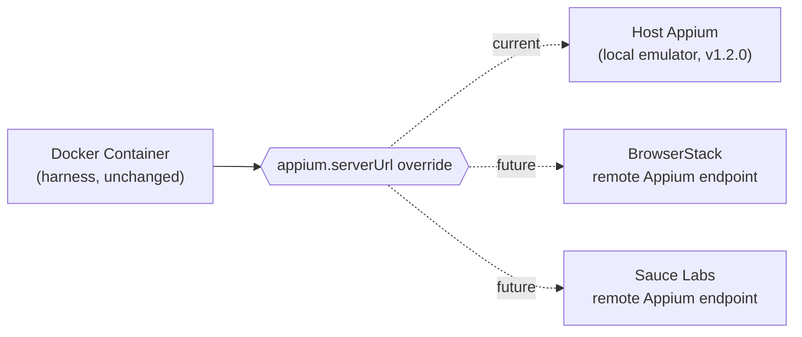
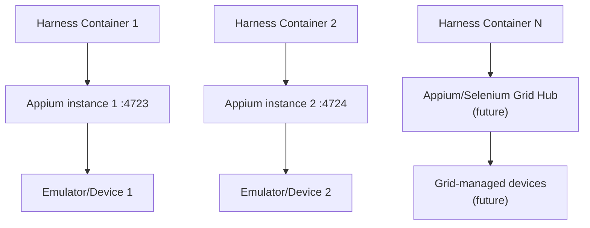

# Phase 19.2 — Docker Architecture Specification
## Mobile Automation Framework v1.2.0

No Dockerfile, docker-compose.yml, Java source, `build.gradle`, or `.github/workflows/mobile-automation.yml` was created or modified to produce this document. Nothing was committed or pushed. This is architecture design only.

---

## 1. Executive Summary

This specification defines the v1.2.0 Docker architecture for the Mobile Automation Framework: **Model 3** — a container holding only the Java/Gradle test harness, communicating over plain HTTP with an Appium server that continues to run directly on the host, exactly as it already does in the verified v1.1.0 baseline. The Android emulator, ADB, and Appium all remain **outside** Docker on every platform. This decision is not a preference — it is the direct conclusion of three prior evidence-gathering phases (19.1A code/research, 19.1B Windows proof, 19.1C GitHub Linux proof), all of which are cited by section below rather than re-argued. The v1.1.0 baseline (19/19 tests, two consecutive green CI runs) is treated as frozen and is not redesigned anywhere in this document.

---

## 2. Current Architecture

Established by direct repository inspection (VERIFIED, not assumed):

| Component | Value | Source |
|---|---|---|
| Java | 17 (Temurin toolchain) | `build.gradle` `java { toolchain { languageVersion = JavaLanguageVersion.of(17) } }` |
| Gradle | 9.0.0, via wrapper | `gradle/wrapper/gradle-wrapper.properties` (`gradle-9.0.0-bin.zip`) |
| Test framework | TestNG 7.10.2 | `build.gradle` dependency |
| Appium client | `io.appium:java-client:9.4.0` | `build.gradle` |
| Selenium | `org.seleniumhq.selenium:selenium-java:4.25.0` | `build.gradle` |
| Reporting | ExtentReports 5.1.1 | `build.gradle` |
| Logging | SLF4J 2.0.16 + Log4j2 2.24.1 | `build.gradle` |
| Package structure | `com.mobileautomation.framework.{config,driver,core,locators,listeners,reporting,utils,...}` under `src/main/java`; `{pages,tests,assertions,runners}` under `src/test/java` | direct directory listing |
| Appium server URL | `appium.serverUrl`, default `http://127.0.0.1:4723`, resolved via system-property → env-file → common-file → compiled-default precedence | `ConfigurationKeys.APPIUM_SERVER_URL`, `ConfigurationDefaults.DEFAULT_APPIUM_SERVER_URL`, `ConfigReader.getAppiumServerUrl()` |
| Config files | `config.properties` (common), `config-emulator.properties`, `config-real-device.properties` under `src/test/resources/config/` | direct listing |
| Report output | `reports/` (`report.directory`), `reports/screenshots/` (`report.screenshotDirectory`) | `config.properties`, `ConfigurationDefaults` |
| Log output | `logs/` (`logging.directory`) | `config.properties`, `ConfigurationDefaults` |
| Test execution command | `./gradlew test --no-daemon -Denv=emulator -Dplatform.version=... -Ddevice.name=... -Dapp.path=...` | `.github/workflows/mobile-automation.yml` (production, unmodified) |
| Existing Docker files | **None** — no `Dockerfile`, no `docker-compose.yml`, no Docker references in `.gitignore` | repository-wide search, zero matches |
| CI | GitHub Actions, `ubuntu-24.04`, `reactivecircus/android-emulator-runner@v2.38.0`, Appium 3.6.0, UiAutomator2 driver 8.2.2, API 34/`google_apis`/`x86_64`/pixel | `.github/workflows/mobile-automation.yml`, Phase 17 Final Report |

**All entries above: VERIFIED** (direct repository evidence, this phase).

---

## 3. Verified Phase 19.1 Findings (Summary — Not Re-Derived)

| Finding | Phase | Classification |
|---|---|---|
| Java test harness has zero direct ADB dependency — all device interaction goes through Appium's HTTP API | 19.1A | VERIFIED (code tracing) |
| Windows + Docker Desktop: `host.docker.internal` + temporary `adb -a` rebind → full ADB device communication | 19.1B | VERIFIED (real execution) |
| GitHub Linux: `--network=host`, plain `127.0.0.1`, **no rebind needed** → full ADB device communication (Model 1) | 19.1C | VERIFIED (real execution) |
| GitHub Linux: `--network=host` → full real Appium session against the live emulator, verified via the session response's own device details (Model 3) | 19.1C | VERIFIED (real execution, session level) |
| `CapabilityConfiguration` has no `remoteAdbHost`/`systemPort`/`adbPort` fields — required only if Model 1 is later chosen | 19.1A | VERIFIED (code reading), still true — untouched by any phase since |
| Model 3 recommended over Model 1: zero framework changes, fully proven at session level, lower operational risk | 19.1C §15 | INFERRED from the above VERIFIED facts, adopted as this phase's starting decision per the user's own brief |

---

## 4. Architecture Goals

1. Containerize the Java/Gradle test-harness execution environment for reproducibility (pinned JDK, Gradle, OS, dependency resolution).
2. Preserve the v1.1.0 non-Docker execution path unchanged and fully functional.
3. Require zero changes to `CapabilityConfiguration`, Appium capabilities, or test/page-object code.
4. Work on both Windows + Docker Desktop (local development) and GitHub-hosted Ubuntu (CI), using platform-appropriate networking without pretending the two are identical.
5. Keep reports, logs, and screenshots accessible on the host filesystem, not trapped inside the container.
6. Leave a documented, evidence-based extension path toward parallelization and cloud device providers, without building any of it now.

---

## 5. Non-Goals (This Phase and v1.2.0 Scope)

- Containerizing the Android emulator, Appium, or ADB (explicitly excluded by the selected Model 3 architecture).
- Docker-in-Docker.
- BrowserStack/Sauce Labs integration (future-compatibility only, Section 20).
- Parallel execution or Grid (extension points only, Section 21).
- Any change to the v1.1.0 CI workflow, test code, or framework capabilities.
- Producing the actual `Dockerfile`/`docker-compose.yml` (Phase 19.3, not this phase).

---

## 6. Selected Architecture

**Model 3**, per the explicit brief and the evidence in Section 3:

```
Docker Container                    Host
├── Java 17                         ├── Android Emulator (API 34, google_apis, x86_64, pixel)
├── Gradle 9.0.0 (wrapper)          ├── ADB
└── Test harness (unmodified)  ──HTTP──▶  Appium Server (3.6.0 / UiAutomator2 8.2.2)
                                            (talks to ADB/emulator exactly as in v1.1.0 today)
```

The container's only externally-visible responsibility is: compile and run the existing Gradle test task, reaching Appium over one HTTP port. Everything below that port is unchanged from v1.1.0.

---

## 7. Container Boundary

**Belongs inside Docker (VERIFIED as sufficient, nothing more):**

| Component | Justification |
|---|---|
| JDK 17 | Required to run Gradle/TestNG — already the project's pinned version (`build.gradle`) |
| Gradle | The project already ships its own wrapper (`gradlew`, `gradle-wrapper.properties`, pinned to 9.0.0) — the container uses the *committed* wrapper, not a separately chosen Gradle install |
| Git | Only if the image is built from a checked-out working tree passed in as build context; not required if source is bind-mounted (Section 12) — **not decided in this phase**, left as an implementation-time choice, not an architecture-blocking one |
| Test dependencies | Resolved by Gradle from the existing `build.gradle` dependency list (Appium Java Client, Selenium, TestNG, ExtentReports, Log4j2, Jackson, Lombok, Commons Lang3) — nothing new added |
| CLI utilities | None beyond what the JDK/Gradle image already provides — **no `adb`, no Android SDK, no Node.js, no Appium** |

**Explicitly does NOT belong inside Docker** (per Section 3's Model 3 finding and the explicit brief):

- Android SDK, `platform-tools`/`adb`, `emulator` binary, system images — Phase 19.1B's own Section 17 already proved these are unnecessary even for the ADB-owning Model 1; under Model 3 the container never talks to ADB at all, so this is doubly true.
- Appium server, UiAutomator2 driver, Node.js — these run on the host under Model 3.
- The Android emulator itself.

**Classification: VERIFIED minimum** (directly demonstrated by Phase 19.1C's Model 3 test, which needed no Android tooling of any kind inside the container — only `curl`).

---

## 8. Host Boundary

Unchanged from v1.1.0 in every respect:

| Component | Owner | Evidence |
|---|---|---|
| Android Emulator (API 34/google_apis/x86_64/pixel) | Host | `.github/workflows/mobile-automation.yml`, Phase 17 Final Report |
| ADB | Host | `ConfigReader`/`AndroidDriverFactory` never invoke ADB directly (Phase 19.1A code tracing) — Appium owns it |
| Appium Server (3.6.0) + UiAutomator2 driver (8.2.2) | Host | Same version pins as production CI; Phase 19.1C proved a real session against these exact versions |
| AUT installation/lifecycle | Host, via Appium | Unchanged — `app.path`/`app.package`/`app.activity` capabilities resolved exactly as today |
| Emulator lifecycle (boot/shutdown) | Host | Windows: developer-managed; GitHub Actions: `reactivecircus/android-emulator-runner`, unmodified |

**Classification: VERIFIED** (nothing here changes from the already-frozen v1.1.0 architecture).

---

## 9. Network Architecture

### 9.1 Windows + Docker Desktop

| Property | Value | Classification |
|---|---|---|
| Appium host address (from container) | `host.docker.internal` | VERIFIED (Phase 19.1B, resolved without extra flags) |
| Container → host communication | Plain HTTP to `host.docker.internal:4723` | INFERRED from Phase 19.1B's equivalent TCP-port proof (port 5037) — the DNS/TCP mechanism is identical regardless of destination port; the destination port itself (4723) was not directly dialed in 19.1B, only 5037 |
| Required ports | 4723 (Appium HTTP) | Existing project default (`ConfigurationDefaults.DEFAULT_APPIUM_SERVER_URL`) |
| Special Docker networking flags | None required | VERIFIED — Phase 19.1B confirmed `host.docker.internal` resolves on Docker Desktop with no `--add-host` flag |
| ADB rebind (`adb -a`) | **Not required under Model 3** | The container never talks to ADB directly — only Appium does, and Appium already runs on the host next to ADB exactly as in v1.1.0 |
| Firewall changes | None required | VERIFIED (Phase 19.1B found no firewall rule was needed for the equivalent port-5037 case) |

### 9.2 GitHub-hosted Ubuntu

| Property | Value | Classification |
|---|---|---|
| Appium host address (from container) | `127.0.0.1` (via shared network namespace) | VERIFIED (Phase 19.1C, exact port 4723, full session-level proof) |
| Container → host communication | `docker run --network=host ...` | VERIFIED (Phase 19.1C) |
| Required ports | 4723 (Appium HTTP) | VERIFIED (Phase 19.1C used this exact port and got a real session) |
| `host.docker.internal` required? | **No** — and must not be assumed to work the same way as Windows | VERIFIED absence of need (Phase 19.1C deliberately avoided it and succeeded) |
| ADB rebind required? | No — not applicable under Model 3 (container never touches ADB) | Consistent with Phase 19.1C Model 3 result |

**Both subsections: VERIFIED**, kept explicitly separate per the brief's own instruction not to conflate the two platforms.

---

## 10. Appium Communication

- **Base URL / port**: `appium.serverUrl`, already a first-class configuration key (`ConfigurationKeys.APPIUM_SERVER_URL`), default `http://127.0.0.1:4723` (`ConfigurationDefaults.DEFAULT_APPIUM_SERVER_URL`).
- **Environment/property strategy**: The framework's existing four-tier precedence (system property → environment-specific properties file → common properties file → compiled default) is reused **unchanged**. The container-specific value is supplied the same way the existing CI workflow already supplies `-Ddevice.name=...`/`-Dplatform.version=...`: via `-Dappium.serverUrl=...` on the `gradlew test` invocation.
- **Local default behavior (non-Docker)**: Unaffected — `http://127.0.0.1:4723` continues to work exactly as today when Gradle runs directly on the developer's machine.
- **Local Docker behavior**: `-Dappium.serverUrl=http://host.docker.internal:4723` (Windows) — a container-specific override, never a change to the compiled default.
- **CI Docker behavior (future)**: `-Dappium.serverUrl=http://127.0.0.1:4723` (Linux, `--network=host` — the container's own loopback already *is* the runner's loopback, so the existing default value would even work unmodified if `--network=host` is used, though an explicit override is still recommended for clarity).
- **Failure behavior when Appium is unavailable**: Unchanged — this is entirely governed by the existing `AndroidDriverFactory`/`DriverManager` and Appium Java Client's own connection-failure handling; Docker introduces no new failure mode here beyond "the configured URL happens to be unreachable," which the framework already has to handle today (e.g., a developer forgetting to start Appium locally).

**No framework code change is required to support any of the above** — every mechanism cited already exists and is already exercised by the production CI workflow for other keys (`device.name`, `platform.version`, `app.path`). **VERIFIED** (direct code reading, Section 2).

---

## 11. Configuration Strategy

Industry-standard, and already the project's existing pattern — this section defines *how the Docker container is invoked*, not a new configuration subsystem:

| Concern | Approach |
|---|---|
| Environment variables | The container run command sets one variable/property representing the resolved Appium URL for the current platform — computed by whatever invokes `docker run` (a developer's shell, or a future CI step), never hardcoded into an image layer |
| Gradle properties / system properties | Passed via `-Dappium.serverUrl=...` at `gradlew test` invocation time inside the container — identical mechanism to the existing `-Ddevice.name=...` pattern |
| Local default behavior | If no override is supplied, the compiled default (`http://127.0.0.1:4723`) applies — correct for non-Docker execution, intentionally *not* correct for Docker execution (an override is mandatory in the Docker path, by design, so a misconfigured container fails fast rather than silently talking to itself) |
| Windows Docker behavior | Override value literally contains the string `host.docker.internal` |
| GitHub Actions behavior (future) | Override value literally contains `127.0.0.1` (or the default is left as-is, since it already matches under `--network=host`) |
| What must never be hardcoded | Developer-specific IPs, machine names, credentials/secrets, absolute Windows paths — none of the values above are host-specific; `host.docker.internal` is a Docker Desktop *constant*, not a per-machine value, and `127.0.0.1`/`--network=host` are equally universal on any Linux Docker host |

**Classification: FUTURE DESIGN**, grounded in VERIFIED existing mechanisms (Section 10) — the strategy itself has not been implemented, only the underlying hooks it will use.

---

## 12. Docker Image Architecture (Conceptual — No Dockerfile)

| Aspect | Recommendation | Rationale |
|---|---|---|
| Base image family | An official `eclipse-temurin:17-jdk` (or equivalent) JDK image, Debian- or Alpine-based | Matches the project's pinned Java 17 toolchain exactly (Section 2); avoids introducing an untracked JDK vendor/version |
| Gradle strategy | Use the project's **own committed wrapper** (`./gradlew`), not a separate Gradle base image | The wrapper already pins the exact build (`gradle-9.0.0-bin.zip`, checksummed) — reusing it means the container's Gradle version can never drift from what a non-Docker developer run uses |
| OS distribution | Debian-slim variant preferred over Alpine | Alpine's musl libc has historically caused subtle JVM/native-library issues; Debian-slim is the more conservative, lower-surprise choice for a JVM-heavy toolchain (Appium Java Client, Selenium, Jackson, Lombok annotation processing) |
| User model | Non-root application user | Standard container-security baseline (Section 13); the harness needs no elevated privileges |
| Working directory | A dedicated non-root-owned path (e.g. `/workspace`) | Conventional, avoids permission conflicts with a non-root user |
| Dependency caching | Gradle's own dependency cache directory, mounted or layered so `build.gradle`'s dependency list is not re-resolved on every container run | Directly reduces the one clearly measurable Docker cost (network dependency resolution), see Section 13 |
| Layer ordering | Dependency-resolution layer before source-copy layer (copy `build.gradle`/`gradle.properties`/wrapper first, run a dependency-resolution step, then copy source) | Standard Docker layer-caching practice — source changes (the common case) don't invalidate the expensive dependency layer |
| Reproducibility strategy | Pin the base image by digest (not just tag) once implementation begins | Tags can be repointed by the upstream image maintainer; a digest cannot — consistent with this project's existing "no floating `latest`" discipline already applied to GitHub Actions (`actions/checkout@v7.0.1`, etc.) |
| Tagging/versioning | Tag the harness image with the project's own version (e.g. `mobile-automation-harness:1.2.0`), not `latest` | Same floating-tag discipline as above |

**Classification: FUTURE DESIGN** — none of this is implemented; each choice is justified against evidence already established in this document (Section 2's pinned versions) or against this project's own established conventions (the CI workflow's version-pinning discipline, cited directly).

---

## 13. Reproducibility

**What Docker makes reproducible:**

| Currently (non-Docker) | With Docker (Model 3) |
|---|---|
| Developer's locally-installed JDK (version drift possible between machines) | Pinned JDK inside the image |
| Developer's Gradle install (mitigated today only by the wrapper) | Same wrapper, now also running inside a pinned OS/JDK combination |
| Developer's OS-level libraries/locale/encoding | Pinned, controlled base image |
| Dependency resolution (already reasonably reproducible via `build.gradle` version pins) | Additionally isolated from any stray global Gradle/Maven cache pollution on the host |

**What Docker explicitly does NOT make reproducible** (this is the core reason Model 3 was selected over Model 1 — stated plainly, not glossed over):

- **The Android emulator** — its version, system image, and boot behavior remain entirely host-managed and outside the container's control, on both Windows and GitHub Actions.
- **The Appium server and UiAutomator2 driver** — version pins (3.6.0 / 8.2.2) are enforced today by the *host-side* install steps in the production CI workflow, not by anything Docker touches under Model 3.
- **ADB** — remains whatever version the host happens to have (Phase 19.1B: 36.0.2 on the Windows dev machine; Phase 19.1C: 37.0.1 on the GitHub runner — a real, observed version difference that Docker does nothing to close).
- **Host hardware** (KVM acceleration, CPU architecture) — unaffected by containerizing only the harness.
- **Windows vs. Linux differences** — Section 9 already shows the *networking* differs by platform; Docker does not unify this, it only adds one more layer that itself must be configured per-platform.

**Classification: VERIFIED** for the "does not make reproducible" list (directly evidenced by the differing ADB versions observed in Phases 19.1B/19.1C, and by the architecture's own host-boundary definition in Section 8); **INFERRED/FUTURE DESIGN** for the "makes reproducible" list (a reasonable, standard consequence of containerizing a JVM toolchain, not yet measured on this project).

---

## 14. Local Execution Model (Developer Workflow — Conceptual)

1. Developer starts the Android Emulator on the host (unchanged from today).
2. Developer starts Appium 3.6.0 (UiAutomator2 driver 8.2.2) on the host, listening on `4723` (unchanged from today).
3. Developer starts the harness container, passing `-Dappium.serverUrl=http://host.docker.internal:4723` (Windows-specific value, Section 9.1).
4. The container runs `./gradlew test -Denv=... -Dappium.serverUrl=... [other existing -D flags unchanged]`.
5. The container reaches the host's Appium server over HTTP; Appium drives the emulator via ADB exactly as it does outside Docker today.
6. Reports/logs/screenshots are written to a host-mounted directory (Section 15) so they remain accessible after the container exits.

This is a workflow description, not an implementation — no actual commands, mount syntax, or scripts are finalized here (that is Phase 19.3's job). **Classification: FUTURE DESIGN.**

---

## 15. GitHub Actions Execution Model (Future — Not Implemented, Existing Workflow Untouched)

```
GitHub Ubuntu Runner
    ├── Android Emulator        (reactivecircus/android-emulator-runner, unchanged)
    ├── ADB                     (host-managed, unchanged)
    ├── Appium 3.6.0 + UiAutomator2 8.2.2   (host-managed, unchanged install steps)
    └── Docker (--network=host)
          └── Harness container: Java 17 + Gradle 9.0.0 (wrapper) + test source
                    │
                    │ HTTP → 127.0.0.1:4723 (Section 9.2)
                    ▼
              Host Appium Server → Host ADB → Android Emulator
```

Every component above the "Docker" line already exists, unmodified, in `.github/workflows/mobile-automation.yml`. The only conceptually new element is an additional step that runs the harness container instead of (or as an alternative execution path alongside) the current direct `./gradlew test` step. **This document does not decide whether that step replaces or supplements the current step** — that is an implementation-phase decision informed by the migration strategy in Section 24. **Classification: FUTURE DESIGN**, built entirely on VERIFIED Phase 19.1C evidence for the networking layer.

---

## 16. Artifact Architecture

| Artifact | Current location (v1.1.0) | Docker-era requirement |
|---|---|---|
| ExtentReports HTML | `reports/` (`report.directory`) | Must be written to a host-mounted path, not left inside the container's writable layer — the container is disposable, its filesystem is not a durable artifact store |
| Gradle test report | `build/reports/tests/test/` (Gradle default) | Same — host-mounted |
| JUnit-format XML results | `build/test-results/test/` (Gradle default, corrected in MA-CICD-002 v1.0) | Same — host-mounted |
| Screenshots | `reports/screenshots/` (`report.screenshotDirectory`) | Same — host-mounted |
| Logs | `logs/` (`logging.directory`) | Same — host-mounted |

The unifying principle: **no artifact path changes** — every directory above is already exactly what the existing framework writes to, unmodified. The only new requirement is that whatever runs the container (developer shell locally, or a future CI step) exposes these same paths back to the host filesystem, so the existing `actions/upload-artifact@v7.0.1` step (production workflow, unmodified) continues to find them in a hypothetical future integration. **Classification: FUTURE DESIGN**, constrained by VERIFIED existing paths (Section 2).

---

## 17. Caching Strategy

| Cache | Recommendation | Rationale |
|---|---|---|
| Gradle dependency cache | Yes — persist across container runs (e.g., a named volume or bind mount to the host's Gradle cache directory) | Directly addresses the one clearly measurable Docker cost: re-resolving `build.gradle`'s dependency list on every run. Already proven valuable in the existing CI workflow via `gradle/actions/setup-gradle@v6.3.0`'s own caching. |
| Docker build cache | Yes — standard layer caching (Section 12's layer-ordering recommendation exists specifically to make this effective) | Free, built into Docker itself; no extra tooling needed |
| CI cache (future) | Reuse the existing `actions/cache@v6.1.0` pattern already used for the AUT APK in the production workflow, applied to the Gradle cache if/when Docker is integrated into CI | Consistent with an already-proven, already-verified caching mechanism in this exact repository — not a new pattern |
| Local cache | Developer's own Gradle cache, mounted into the container | Avoids every local Docker run re-downloading the same dependencies already sitting on the developer's machine |

**Recommendation deliberately excludes**: a separate Docker registry/pull-through cache, a dedicated build-cache server, or any multi-machine cache-sharing infrastructure — none of these provide measurable value at this project's current single-developer, single-CI-runner scale. **Classification: FUTURE DESIGN**, deliberately scoped to avoid over-engineering per the phase's own instruction.

---

## 18. Security Model

| Concern | Position | Rationale |
|---|---|---|
| Running as non-root | Recommended (Section 12) | Standard baseline; the harness has no legitimate need for root inside the container |
| Secrets | None required by this architecture | Model 3 introduces no new secret — Appium/ADB/emulator have never required credentials in this project, and nothing here changes that |
| Host networking | `--network=host` is required on Linux (Section 9.2, VERIFIED) | This does widen the container's network visibility to the full host network namespace — an accepted, explicitly-acknowledged trade-off (Section 23), scoped to CI runners that are already ephemeral, single-job, and not multi-tenant (consistent with this project's existing CI trust model) |
| Exposed ports | None need to be *exposed outward* — the container only makes an outbound connection to the host's Appium port; nothing needs to accept inbound connections | Lower risk than a service-style container |
| Filesystem mounts | Source/report directories only (Section 16) | No mount of sensitive host paths is required |
| Container permissions | Default, non-privileged | The container never needs `--privileged` — it does not touch KVM, ADB, or any device node directly under Model 3 |
| Docker socket access | Not required | The harness container never needs to launch sibling containers or otherwise talk to the Docker daemon |
| Docker-in-Docker | **Explicitly not introduced** | No component of Model 3 requires it — the emulator/Appium/ADB stack is entirely host-side, so there is nothing for a nested Docker daemon to do |

**Classification: FUTURE DESIGN**, with the `--network=host` trade-off specifically flagged as VERIFIED-necessary (Phase 19.1C) rather than a convenience choice.

---

## 19. Windows/Linux Differences

| Area | Windows + Docker Desktop | GitHub Ubuntu |
|---|---|---|
| Container networking | Docker Desktop VM-backed (`desktop-linux` context) | Native Docker engine (`default` context) |
| Host Appium access | `host.docker.internal:4723` | `127.0.0.1:4723` via `--network=host` |
| Emulator | Host-managed; **no local AVD exists on the reference dev machine by default** (Phase 19.1B had to build one temporarily) | Host-managed via `reactivecircus/android-emulator-runner`, already proven at 19/19 in production |
| ADB | Default loopback-only binding; **no rebind needed under Model 3** (only Appium talks to it) | Default loopback-only binding; **no rebind needed under Model 3**, and even Model 1 needed none on Linux (19.1C) |
| Required Docker flags | None beyond a normal `docker run` (no `--network=host`, no `--add-host`) | `--network=host` required |
| Main risk | Docker Desktop's own stability (a real, encountered issue in Phase 19.0 — a stale-AF_UNIX-socket crash bug, [docker/desktop-feedback#460](https://github.com/docker/desktop-feedback/issues/460), unrelated to this architecture but a genuine operational risk on this platform) | `--network=host` broadens container network visibility (Section 18) — an accepted trade-off, not a defect |

**All rows: VERIFIED**, sourced directly from Phase 19.0/19.1B/19.1C execution evidence — nothing in this table is inferred.

---

## 20. Model 1 vs. Model 3 — Final Decision

| Criterion | Model 1 | Model 3 (selected) |
|---|---|---|
| Complexity | Higher — container carries Java, Gradle, Node, Appium, `adb` | Lower — container carries only Java and Gradle |
| Framework impact | Requires new `CapabilityConfiguration` fields (`remoteAdbHost`/`systemPort`/`adbPort`) — never built, never exercised in any phase | None — `appium.serverUrl` already supports this exact use case |
| Networking | Two different host-side procedures across platforms (Windows needs `adb -a` rebind + DNS; Linux needs neither) | One conceptual model on both platforms — "reach a host HTTP port" — differing only in which Docker flag exposes it |
| Debugging | More failure layers: container DNS, container TCP, host ADB rebind, Appium's remote-ADB capability wiring (still unproven) | Fewer layers, and the one it depends on is proven at full session depth (19.1C) |
| Portability | Platform-specific host prerequisites (the rebind step) | Same conceptual model everywhere |
| Reproducibility | Also isolates the `adb` binary version inside the container — but this only matters if the container's ADB client version diverges meaningfully from the host's, which was never tested | No additional reproducibility benefit claimed beyond Section 13 |
| Scalability / parallel execution | No evidence gathered in any phase | No evidence gathered in any phase — this document does not claim Model 3 is proven superior here, only that neither has been tested (Section 21) |
| Future Grid | No evidence | Appium already running as a plain host HTTP service is the more natural starting point for a future Grid/hub model (Section 21) — a reasoned extrapolation, not a proven claim |
| BrowserStack/Sauce Labs | Not evaluated | Not evaluated (Section 20 of this document is a separate section addressing this directly) |
| CI/CD | Would require the currently-unbuilt capability layer before any CI integration could even be attempted | Can be integrated using only mechanisms already proven in production CI (system-property overrides) |

**Decision: Model 3, for this framework and this v1.2.0 scope specifically** — not a universal claim that Model 3 is always the better architecture in general. It is the better fit here because: (a) this project's Appium/ADB/emulator pairing is already a proven, 19/19-verified asset that Model 3 leaves completely untouched, and (b) Model 1's one claimed advantage — more of the toolchain inside a container — depends on a framework capability that no phase has ever built or tested, making it a larger, riskier lift for a benefit this document cannot yet quantify. **Classification: This decision is INFERRED from VERIFIED facts** (Sections 3, 7, 8, 9), consistent with Phase 19.1C's own recommendation.

---

## 21. BrowserStack/Sauce Labs Compatibility (Future Design — Not Implemented)

Model 3's core property — the container only ever needs a reachable Appium-compatible HTTP endpoint and never touches ADB or the emulator directly — is exactly the shape needed for a future cloud-provider integration:

```
Docker (harness, unchanged)
        │  HTTP
        ▼
Host Appium  →  Android Emulator          (v1.2.0, this document)

Docker (harness, unchanged)
        │  HTTPS
        ▼
BrowserStack / Sauce Labs remote Appium endpoint     (future, not this phase)
```

Because the harness container's only coupling to "where Appium lives" is the `appium.serverUrl` configuration value (Section 10) — never a local-only mechanism like ADB — swapping a `host.docker.internal:4723` value for a BrowserStack/Sauce Labs remote URL (plus their respective auth mechanism, itself out of scope here) is architecturally a **configuration change, not a redesign**. This is precisely why Model 1 was not selected: Model 1's approach couples the container tightly to a *local* ADB server, which has no equivalent concept in a cloud-device-provider model — that coupling would have to be undone later. Model 3 never creates it in the first place. **Classification: FUTURE DESIGN**, reasoned from Model 3's already-established properties (Section 10) — no cloud provider has been contacted, tested, or integrated in this or any prior phase.

---

## 22. Future Scalability (Extension Points Only — Not Implemented)

| Direction | How Model 3 accommodates it (conceptually) |
|---|---|
| Parallel execution | Multiple harness containers, each configured with a distinct `appium.serverUrl` (or distinct `systemPort`-style Appium-side routing) pointing at multiple host-side Appium instances/emulators — no framework change implied beyond what already exists |
| Multiple Appium servers | Host-side concern only — spinning up N Appium processes on N ports is unrelated to what runs inside the container |
| Multiple devices | Host-side concern — the container's only awareness of "which device" is already parameterized (`device.name`, `platform.version`, existing mechanism) |
| Selenium/Appium Grid | A Grid hub is itself just another Appium-compatible HTTP endpoint from the container's point of view — same `appium.serverUrl` substitution as Section 21 |
| Cloud device providers | Section 21 |
| Jenkins / Azure DevOps / other CI platforms | The harness container's interface is "run in any Docker-capable CI agent, given an `appium.serverUrl`" — not GitHub-Actions-specific in any way; no component of this design assumes GitHub Actions internals |

None of the above is implemented, tested, or scheduled by this document — these are architectural extension points, listed to show Model 3 does not foreclose them, not a roadmap commitment. **Classification: FUTURE DESIGN.**

---

## 23. Risks, Trade-offs, and Operational Complexity

**Benefits:**
- Reproducible JDK/Gradle/OS execution environment for the test harness.
- Zero framework/capability changes required.
- Zero risk to the already-frozen, 19/19-verified v1.1.0 Appium/ADB/emulator pairing.
- A clean, evidence-backed extension path toward cloud providers and parallelization (Sections 21–22).

**Risks / Limitations:**
- `--network=host` on Linux widens the container's network visibility to the full host namespace (Section 18) — an accepted, scoped trade-off on ephemeral CI runners, but a real one worth naming plainly.
- Windows requires a platform-specific `host.docker.internal` value that Linux does not use and must not be assumed to generalize (Section 9) — this is a permanent, not temporary, platform divergence the implementation must carry.
- Docker Desktop itself has demonstrated real operational fragility on the Windows reference machine (Phase 19.0's stale-socket crash) — a risk to local developer workflow, not to CI.
- Reproducibility is partial (Section 13) — the emulator/Appium/ADB layer remains exactly as variable as it is today; Docker does not solve version drift in that layer, only in the harness layer.

**Operational complexity:**
- Developers must now start three things locally instead of two (emulator, Appium, *and* the harness container) — a real, if modest, workflow addition (Section 14).
- CI integration (if pursued) adds a container-orchestration step to a pipeline that currently runs everything as flat shell steps — a genuine new category of failure mode for that pipeline to handle (Section 25 gate).

**Developer experience:** Likely net-neutral to slightly negative for solo local debugging (one more moving part) and net-positive for onboarding/environment-parity (no "works on my machine" JDK/Gradle drift). **Performance:** Not measured in any phase — no claim is made here about container startup overhead vs. direct execution; this is an open question (Section 28).

**Classification: Honest mix of VERIFIED (Docker Desktop fragility, Section 9's platform divergence) and FUTURE DESIGN (developer-experience/performance claims, explicitly marked as unmeasured).**

---

## 24. Migration Strategy

| Phase | Scope | Gate to proceed |
|---|---|---|
| **Phase A — Local-only, opt-in** | Implement the harness `Dockerfile` (Phase 19.3+); developers may *optionally* run tests via Docker locally. The existing `./gradlew test` non-Docker path remains the default and is untouched. | A local Docker run reproduces the same pass/fail outcome as a non-Docker run on the same emulator/Appium session, for at least one full suite execution |
| **Phase B — CI-parallel, non-blocking** | Add Docker-based execution as an *additional*, non-gating CI job/step alongside (not replacing) the existing production `mobile-automation.yml` steps. The production workflow's pass/fail signal continues to come from the existing direct execution path. | The Docker-based CI job reaches 19/19 on at least two consecutive runs, matching the existing baseline's own qualification bar (Phase 17 Final Report) |
| **Phase C — CI-primary (optional, only if desired)** | Only if Phase B is fully satisfactory: consider making the Docker-based path the primary/only CI execution path, retiring the direct-execution steps. | Explicit, separate decision — not automatic; requires its own readiness review, analogous to this project's existing phase-gate discipline |
| **Validation gates (all phases)** | Every phase must reproduce the existing 19/19 result before being trusted for anything beyond its own scope | Directly analogous to how Phase 17.6/18 validated each fix against a real CI run before moving on |
| **Rollback strategy** | At every phase, the non-Docker execution path is never removed, modified, or made secondary until Phase C is explicitly approved — rollback is simply "keep using the existing path," which requires no action since it was never disturbed | Zero-risk rollback by construction, not by a separate rollback procedure that has to be built |

**Classification: FUTURE DESIGN**, structured to mirror this project's own established phase-gate/evidence discipline (explicitly modeled on Phase 17–18's iterate-validate-commit pattern) rather than a generic migration template.

---

## 25. Rollback Strategy

Covered inline in Section 24's table (each phase's rollback is "the previous, still-fully-functional path"). No additional mechanism is needed because this migration strategy never disables or removes the non-Docker path until an explicit, separately-gated Phase C decision — meaning there is never a moment before Phase C where rollback requires anything beyond simply not adopting the new path further.

---

## 26. Architecture Diagrams

### A. Overall Architecture (Model 3)



### B. Local Windows Execution



### C. GitHub Actions Execution (Future)



### D. Future Cloud Execution



### E. Future Scalability



All five diagrams reflect the Model 3 boundary established in Sections 6–8; diagrams C–E are explicitly future-facing and are marked as such by the diagram titles themselves.

---

## 27. Implementation Prerequisites

Before Phase 19.3 (implementation) begins:

1. A concrete decision on Section 12's open item (Git-inside-image vs. bind-mounted source) — not architecture-blocking, but should be settled before writing the actual `Dockerfile`.
2. Confirmation of which base image digest to pin (Section 12) — requires picking a specific, current `eclipse-temurin:17-jdk` digest at implementation time, not guessed here.
3. A decision on Gradle/Docker-layer cache mechanics (named volume vs. bind mount) — Section 17 recommends *that* caching happen, not the exact mechanism.
4. No framework code changes are required as a prerequisite — this is itself a key finding, not an open item.

---

## 28. Open Questions

1. **Performance**: container startup + Gradle cold-start overhead vs. direct execution has never been measured on this project — should be measured during Phase 19.3, not assumed.
2. **Git-inside-image vs. bind-mount** (Section 12/27) — an implementation-time choice with no architecture-level consequence either way.
3. **CI integration shape** (Section 24, Phase B) — whether the future Docker-based CI job runs as a separate job or an additional step within the existing job is an implementation decision, not an architectural one; either satisfies this document's stated boundary (production workflow untouched until Phase B is explicitly scoped).
4. **Parallel execution / Grid** (Section 22) — architecturally accommodated, but entirely unbuilt and untested; any concrete design work here is out of scope until explicitly requested.

None of these four are architecture-blocking (Section 29).

---

## 29. Validation Gates

Per the phase brief's own required checklist:

| Gate | Status |
|---|---|
| Architecture is internally consistent | Met — Sections 6–20 describe one coherent model with no contradictions |
| Model 3 is clearly justified | Met — Section 20, grounded in Section 3's VERIFIED evidence |
| Container boundary is defined | Met — Section 7 |
| Host boundary is defined | Met — Section 8 |
| Networking is defined for Windows and Linux | Met — Section 9, kept explicitly separate |
| Configuration strategy is defined | Met — Sections 10–11, built entirely on existing, already-verified mechanisms |
| Artifact strategy is defined | Met — Section 16 |
| Migration/rollback strategy exists | Met — Sections 24–25 |
| No unresolved issue is architecture-blocking | Met — Section 28's four open questions are all implementation-level, not architectural |

**All nine gates satisfied.**

---

## 30. Final Recommendation

# READY FOR DOCKER IMPLEMENTATION

Every validation gate in Section 29 is satisfied. The architecture is fully specified, evidence-backed at every layer that could be tested (Sections 3, 9, 10), and honest about what remains untested or platform-specific (Sections 13, 19, 23). No framework, test, `build.gradle`, or CI workflow change is required to begin implementation — the entire architecture is additive to the existing, frozen v1.1.0 baseline.

**Next phase: Phase 19.3 — Docker Implementation** (not started by this document). Phase 19.3 should begin with the `Dockerfile` itself (Section 12), resolve the four open questions in Section 28 as implementation details, and follow the Phase A migration step defined in Section 24 — local-only, opt-in, non-disruptive to the existing non-Docker execution path.

---

## Approval

| Role | Name | Status | Date |
|---|---|---|---|
| Prepared By | Project Owner / Repository Maintainer | Submitted | 2026-08-08 |
| Document Status | Draft — Architecture Specification (No Implementation) | — | — |

---

**End of Document — Phase 19.2 Docker Architecture Specification, v1.0**
